# B-tree 資料結構

前言：在學習 PostgreSQL 的過程中，我開始好奇資料庫在執行查詢時，背後是如何提升搜尋效率的。這讓我接觸到了 B-tree 這種常用的資料結構，也因此產生了濃厚的興趣。以下是我針對 B-tree 所整理的學習筆記，並輔以 JavaScript 的實作來說明。

## 📘 B-tree 基本概念

1. **鍵值排序**：每個節點中的鍵值都按照遞增順序儲存。
2. **葉節點標記**：每個節點都有一個布林值 `leaf`，當該節點是葉節點時，此值為 true。
3. **節點容量**：如果 n 是樹的階數（order），每個內部節點最多可以包含 n-1 個鍵值，並且有指向每個子節點的指標。
4. **子節點數量限制**：除了根節點外，每個內部節點最多可以有 n 個子節點，最少要有 ⌈n/2⌉ 個子節點（向上取整）。對於葉節點，最多有 n-1 個鍵值，最少有 ⌈n/2⌉-1 個鍵值。
5. **葉節點深度一致**：所有葉節點都位於相同的深度（即樹的高度 h）。
6. **根節點特性**：如果根節點不是葉節點，則至少有 2 個子節點；如果是葉節點，則至少包含 1 個鍵值。根節點不受最小鍵值數量限制。
7. **高度公式**：如果 n ≥ 1，對於任何包含 n 個鍵值的 B-tree，其高度 h 和最小度數 t ≥ 2，滿足：h ≥ log_t((n+1)/2)。

### 💡 重點說明
- **階數（Order）**：決定了節點可以擁有的最大子節點數量
- **最小度數（Minimum Degree）**：通常記為 t，階數 n 與最小度數 t 的關係為 n = 2t，或 t = ⌈n/2⌉
- **平衡性**：B-tree 透過分裂和合併操作保持所有葉節點在同一層，確保查詢效率

## 🌐 B-tree 常見應用場景

### 1. 資料庫索引
像 PostgreSQL 這類資料庫會用 B-tree 來加快查詢速度，比如快速找到某位使用者或某筆訂單。

### 2. 檔案系統
電腦的檔案系統（像是 Windows 或 Mac）會用 B-tree 來幫忙快速找到檔案或資料夾。

### 3. 關聯式資料庫的的資料查詢 (ex: PostgreSQL)
如果你查詢一段資料範圍（例如「價格在 100 到 200 之間」），PostgreSQL 的 B-tree 索引可以幫你快速抓出結果。

### 4. 作業系統管理記憶體
作業系統會用類似 B-tree 的方法，來記住哪些記憶體有被用到、哪些還空著。

---

## 📈 為什麼 B-tree 搜尋速度快？

B-tree 的設計重點是 **每層節點都儲存多個 key**，這讓整棵樹可以「長得比較矮」，大幅減少從根節點走到葉節點所需的層數（也就是搜尋步驟）。

以下是範例圖示：

高度為 3 的 B-tree（每個節點最多有 3 個子節點）
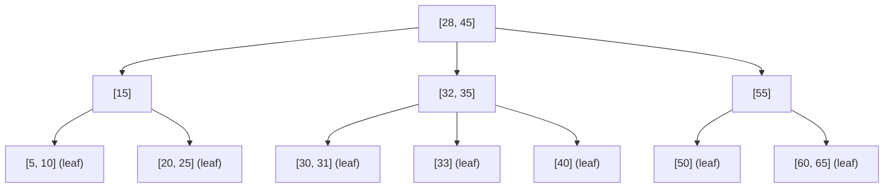

假設你要找的是數字 25：
1. 從 root 節點 \[28, 45] 開始，25 < 28 → 走左邊的路徑。
2. 進入左子節點 \[15]，25 > 15 → 走右邊的路徑。
3. 到達葉節點 \[20, 25]，找到 25！

即使資料筆數變多，只要維持樹的平衡與分裂規則，層數也不會爆增，因此搜尋時間通常維持在 O(log N) 的效率，非常適合大量資料的快速查詢。


# B-tree 基本概念與插入示意（階數 =3, bottom-up 分裂）

插入順序: `[10, 20, 5, 6, 12, 30, 7, 17]`

### Insert 10

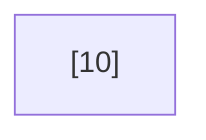

### Insert 20

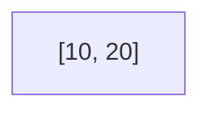

### Insert 5

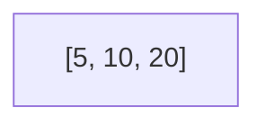

\[5, 10, 20] 滿了，分裂並將 10 上提：

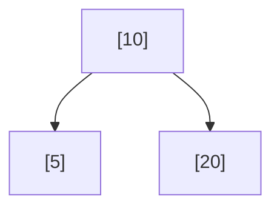

### Insert 6 → 插入左子節點

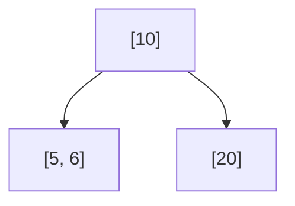

### Insert 12 → 插入右子節點

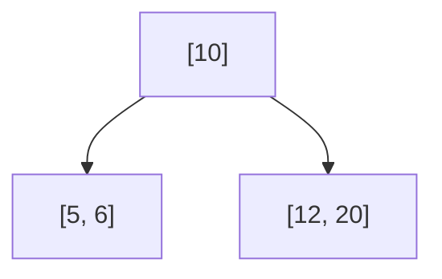

### Insert 30 → 插入右子節點，觸發分裂

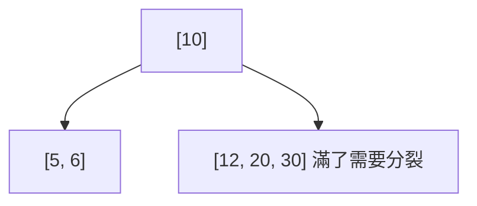

30 插入到 \[12, 20]，導致該節點滿，分裂並將 20 上提：

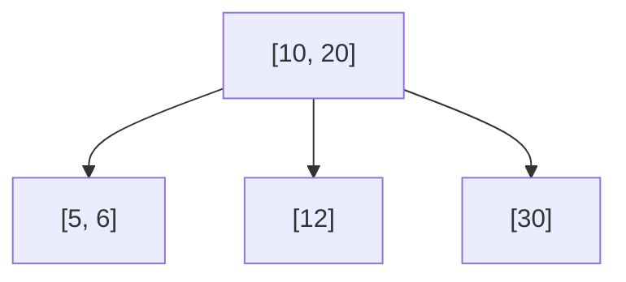

### Insert 7 → 插入左節點，觸發分裂

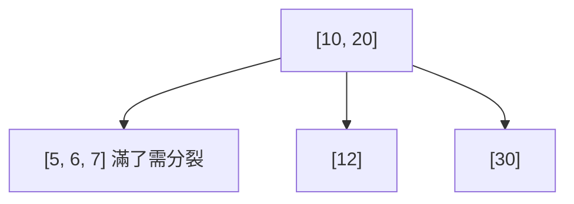

\[5, 6, 7] 滿了，因此將 6 上提，並入 \[10, 20] 內

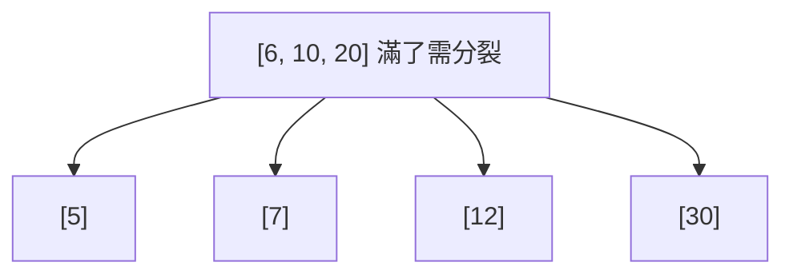

\[6, 10, 20] 滿了，因此將 10 上提

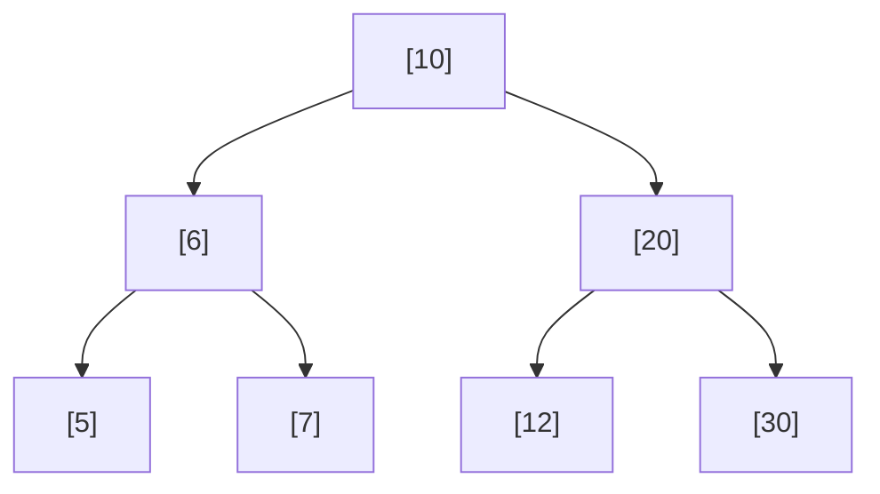

### Insert 17 → 插入 \[12] 成為 \[12, 17]

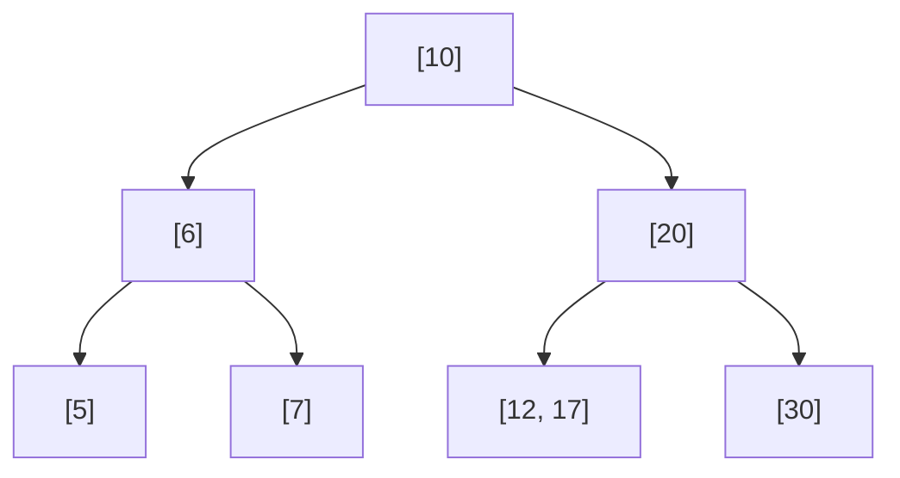

---

## 最終 B-tree 結構


這是一個以 bottom-up 分裂實現的 B-tree，插入順序 `[10, 20, 5, 6, 12, 30, 7, 17]`，結構對齊圖解預期。

# 程式碼實作（由 AI 協助撰寫與整理）

## TL;DR

```js
class BTreeNode {
  constructor(isLeaf = true) {
    this.keys = [];          // 存放鍵值（遞增）
    this.children = [];      // 子節點指標
    this.isLeaf = isLeaf;    // 是否為葉節點
    this.n = 0;              // 當前鍵值數量
  }
}

class BTree {
  constructor(maxDegree = 3) {   // Max Degree (每個節點最多 maxDegree-1 個鍵值)
    this.maxDegree = maxDegree;
    this.maxKeys = maxDegree - 1;  // 最多鍵值數量
    this.root = null;
  }

  // 插入鍵值
  insert(key) {
    if (this.root === null) {
      this.root = new BTreeNode(true);
      this.root.keys[0] = key;
      this.root.n = 1;
    } else {
      // 先插入到適當位置
      this.insertToNode(this.root, key);
      
      // 插入後檢查根節點是否需要分裂
      if (this.root.n > this.maxKeys) {
        this.splitRoot();
      }
    }
  }

  // 插入到節點
  insertToNode(node, key) {
    if (node.isLeaf) {
      // 葉節點：直接插入並保持排序
      let i = node.n - 1;
      while (i >= 0 && node.keys[i] > key) {
        node.keys[i + 1] = node.keys[i];
        i--;
      }
      node.keys[i + 1] = key;
      node.n++;
    } else {
      // 內部節點：找到適當的子節點
      let i = 0;
      while (i < node.n && key > node.keys[i]) {
        i++;
      }

      // 遞歸插入到子節點
      this.insertToNode(node.children[i], key);
      
      // 插入後檢查子節點是否需要分裂
      if (node.children[i].n > this.maxKeys) {
        this.splitChild(node, i);
      }
    }
  }

  // 分裂根節點
  splitRoot() {
    const oldRoot = this.root;
    const newRoot = new BTreeNode(false);
    
    // 創建新的右子節點
    const rightChild = new BTreeNode(oldRoot.isLeaf);
    
    // 計算中間位置
    const middleIndex = Math.floor(oldRoot.n / 2);
    const middleKey = oldRoot.keys[middleIndex];
    
    // 右子節點獲得後半部分的鍵值
    for (let j = middleIndex + 1; j < oldRoot.n; j++) {
      rightChild.keys[j - middleIndex - 1] = oldRoot.keys[j];
    }
    rightChild.n = oldRoot.n - middleIndex - 1;
    
    // 左子節點保留前半部分的鍵值
    oldRoot.n = middleIndex;
    oldRoot.keys.length = middleIndex;
    
    // 如果不是葉節點，需要分配子節點
    if (!oldRoot.isLeaf) {
      // 右子節點獲得後半部分的子節點
      for (let j = middleIndex + 1; j <= oldRoot.children.length - 1; j++) {
        rightChild.children[j - middleIndex - 1] = oldRoot.children[j];
      }
      // 左子節點保留前半部分的子節點
      oldRoot.children.length = middleIndex + 1;
    }
    
    // 設置新根
    newRoot.keys[0] = middleKey;
    newRoot.n = 1;
    newRoot.children[0] = oldRoot;
    newRoot.children[1] = rightChild;
    
    this.root = newRoot;
  }

  // 分裂子節點
  splitChild(parent, index) {
    const fullChild = parent.children[index];
    const newChild = new BTreeNode(fullChild.isLeaf);
    
    // 計算中間位置
    const middleIndex = Math.floor(fullChild.n / 2);
    const middleKey = fullChild.keys[middleIndex];
    
    // 右子節點獲得後半部分的鍵值
    for (let j = middleIndex + 1; j < fullChild.n; j++) {
      newChild.keys[j - middleIndex - 1] = fullChild.keys[j];
    }
    newChild.n = fullChild.n - middleIndex - 1;
    
    // 左子節點保留前半部分的鍵值
    fullChild.n = middleIndex;
    fullChild.keys.length = middleIndex;
    
    // 如果不是葉節點，分配子節點
    if (!fullChild.isLeaf) {
      // 右子節點獲得後半部分的子節點
      for (let j = middleIndex + 1; j <= fullChild.children.length - 1; j++) {
        newChild.children[j - middleIndex - 1] = fullChild.children[j];
      }
      // 左子節點保留前半部分的子節點
      fullChild.children.length = middleIndex + 1;
    }
    
    // 在父節點中為新子節點騰出空間
    for (let j = parent.n; j > index; j--) {
      parent.children[j + 1] = parent.children[j];
    }
    parent.children[index + 1] = newChild;
    
    // 在父節點中插入中間鍵值
    for (let j = parent.n - 1; j >= index; j--) {
      parent.keys[j + 1] = parent.keys[j];
    }
    parent.keys[index] = middleKey;
    parent.n++;
  }

  // 刪除鍵值
  delete(key) {
    if (!this.root) {
      console.log("Tree is empty");
      return;
    }

    this.deleteFromNode(this.root, key);

    // 如果根節點變空了
    if (this.root.n === 0) {
      if (!this.root.isLeaf && this.root.children[0]) {
        this.root = this.root.children[0];
      } else {
        this.root = null;
      }
    }
  }

  // 從節點中刪除鍵值
  deleteFromNode(node, key) {
    const idx = this.findKey(node, key);

    if (idx < node.n && node.keys[idx] === key) {
      // 找到了要刪除的鍵值
      if (node.isLeaf) {
        this.removeFromLeaf(node, idx);
      } else {
        this.removeFromNonLeaf(node, idx);
      }
    } else {
      // 鍵值不在當前節點中
      if (node.isLeaf) {
        console.log(`Key ${key} not found in tree`);
        return;
      }

      // 判斷鍵值是否在子樹中
      const isInSubtree = (idx === node.n) ? true : false;

      // 如果子節點的鍵值數量等於最小值，需要先填充
      if (node.children[idx].n === Math.ceil(this.maxKeys / 2)) {
        this.fill(node, idx);
      }

      // 遞歸刪除
      if (isInSubtree && idx > node.n) {
        this.deleteFromNode(node.children[idx - 1], key);
      } else {
        this.deleteFromNode(node.children[idx], key);
      }
    }
  }

  // 查找鍵值在節點中的位置
  findKey(node, key) {
    let idx = 0;
    while (idx < node.n && node.keys[idx] < key) {
      idx++;
    }
    return idx;
  }

  // 從葉節點刪除鍵值
  removeFromLeaf(node, idx) {
    // 將後面的鍵值前移
    for (let i = idx + 1; i < node.n; i++) {
      node.keys[i - 1] = node.keys[i];
    }
    node.n--;
  }

  // 從非葉節點刪除鍵值
  removeFromNonLeaf(node, idx) {
    const key = node.keys[idx];

    if (node.children[idx].n > Math.ceil(this.maxKeys / 2)) {
      // 從左子樹獲取前驅
      const pred = this.getPredecessor(node, idx);
      node.keys[idx] = pred;
      this.deleteFromNode(node.children[idx], pred);
    } else if (node.children[idx + 1].n > Math.ceil(this.maxKeys / 2)) {
      // 從右子樹獲取後繼
      const succ = this.getSuccessor(node, idx);
      node.keys[idx] = succ;
      this.deleteFromNode(node.children[idx + 1], succ);
    } else {
      // 合併鍵值和右子節點
      this.merge(node, idx);
      this.deleteFromNode(node.children[idx], key);
    }
  }

  // 獲取前驅鍵值
  getPredecessor(node, idx) {
    let curr = node.children[idx];
    while (!curr.isLeaf) {
      curr = curr.children[curr.n];
    }
    return curr.keys[curr.n - 1];
  }

  // 獲取後繼鍵值
  getSuccessor(node, idx) {
    let curr = node.children[idx + 1];
    while (!curr.isLeaf) {
      curr = curr.children[0];
    }
    return curr.keys[0];
  }

  // 填充子節點
  fill(node, idx) {
    const minKeys = Math.ceil(this.maxKeys / 2);

    // 如果前一個兄弟節點有多餘的鍵值，從前面借
    if (idx !== 0 && node.children[idx - 1].n > minKeys) {
      this.borrowFromPrev(node, idx);
    }
    // 如果後一個兄弟節點有多餘的鍵值，從後面借
    else if (idx !== node.n && node.children[idx + 1].n > minKeys) {
      this.borrowFromNext(node, idx);
    }
    // 如果兄弟節點都沒有多餘的鍵值，合併
    else {
      if (idx !== node.n) {
        this.merge(node, idx);
      } else {
        this.merge(node, idx - 1);
      }
    }
  }

  // 從前一個兄弟節點借一個鍵值
  borrowFromPrev(node, childIdx) {
    const child = node.children[childIdx];
    const sibling = node.children[childIdx - 1];

    // 將父節點的鍵值下移到子節點
    for (let i = child.n - 1; i >= 0; i--) {
      child.keys[i + 1] = child.keys[i];
    }

    if (!child.isLeaf) {
      for (let i = child.n; i >= 0; i--) {
        child.children[i + 1] = child.children[i];
      }
    }

    child.keys[0] = node.keys[childIdx - 1];

    if (!child.isLeaf) {
      child.children[0] = sibling.children[sibling.n];
    }

    node.keys[childIdx - 1] = sibling.keys[sibling.n - 1];

    child.n++;
    sibling.n--;
  }

  // 從後一個兄弟節點借一個鍵值
  borrowFromNext(node, childIdx) {
    const child = node.children[childIdx];
    const sibling = node.children[childIdx + 1];

    child.keys[child.n] = node.keys[childIdx];

    if (!child.isLeaf) {
      child.children[child.n + 1] = sibling.children[0];
    }

    node.keys[childIdx] = sibling.keys[0];

    for (let i = 1; i < sibling.n; i++) {
      sibling.keys[i - 1] = sibling.keys[i];
    }

    if (!sibling.isLeaf) {
      for (let i = 1; i <= sibling.n; i++) {
        sibling.children[i - 1] = sibling.children[i];
      }
    }

    child.n++;
    sibling.n--;
  }

  // 合併子節點
  merge(node, idx) {
    const child = node.children[idx];
    const sibling = node.children[idx + 1];

    // 將父節點的鍵值和右兄弟的所有鍵值拉到左子節點
    child.keys[child.n] = node.keys[idx];

    for (let i = 0; i < sibling.n; i++) {
      child.keys[i + child.n + 1] = sibling.keys[i];
    }

    if (!child.isLeaf) {
      for (let i = 0; i <= sibling.n; i++) {
        child.children[i + child.n + 1] = sibling.children[i];
      }
    }

    // 將父節點的鍵值前移
    for (let i = idx + 1; i < node.n; i++) {
      node.keys[i - 1] = node.keys[i];
    }

    // 將子節點指針前移
    for (let i = idx + 2; i <= node.n; i++) {
      node.children[i - 1] = node.children[i];
    }

    child.n += sibling.n + 1;
    node.n--;
  }

  // 打印 B-tree（層序遍歷）
  print() {
    if (!this.root) {
      console.log('Empty B-Tree');
      return;
    }

    console.log(`B-Tree structure (Max Degree = ${this.maxDegree}):`);
    this.printLevel(this.root, 0);
  }

  // 遞歸打印每一層
  printLevel(node, level) {
    if (!node) return;

    const indent = '  '.repeat(level);
    const keys = node.keys.slice(0, node.n);
    const keyStr = keys.length > 0 ? keys.join(', ') : 'empty';
    console.log(`${indent}Level ${level}: [${keyStr}]${node.isLeaf ? ' (leaf)' : ''}`);

    if (!node.isLeaf) {
      for (let i = 0; i <= node.n; i++) {
        if (node.children[i]) {
          this.printLevel(node.children[i], level + 1);
        }
      }
    }
  }

  // 中序遍歷打印（排序輸出）
  inorderTraversal() {
    const result = [];
    if (this.root) {
      this.traverse(this.root, result);
    }
    console.log('Inorder traversal:', result.join(', '));
    return result;
  }

  traverse(node, result) {
    if (!node) return;

    let i = 0;
    for (i = 0; i < node.n; i++) {
      if (!node.isLeaf && node.children[i]) {
        this.traverse(node.children[i], result);
      }
      result.push(node.keys[i]);
    }
    
    if (!node.isLeaf && node.children[i]) {
      this.traverse(node.children[i], result);
    }
  }
}
```


## 🔗 參考資源與延伸閱讀

1. [Understanding B-Trees: The Data Structure Behind Modern Databases](https://youtu.be/K1a2Bk8NrYQ?si=901s5UgagT-XbkY3) - 這部影片提供了清晰的視覺化流程，幫助我建立 B-tree 的基本認知與操作方式。
2. [PostgreSQL 官方文件：索引與 B-tree](https://www.postgresql.org/docs/current/indexes.html) - 深入了解 B-tree 在實際資料庫系統（如 PostgreSQL）中的應用與最佳化策略。
3. [Rogramiz](https://www.programiz.com/dsa/b-tree)
4. 本篇 JavaScript 實作部分，為了幫助理解整體邏輯與插入／刪除操作，我透過 AI（ChatGPT）輔助生成與優化程式碼，並根據實際學習需求進行調整。
