# B-tree 資料結構

前言：在學習 PostgreSQL 的過程中，我開始好奇資料庫在執行查詢時，背後是如何提升搜尋效率的。這讓我接觸到了 B-tree 這種常用的資料結構，也因此產生了濃厚的興趣。以下是我針對 B-tree 所整理的學習筆記，並輔以 JavaScript 的實作來說明。

## 📘 B-tree 基本概念（根據 JavaScript 實作）

* **階數（order）t**：定義 B-tree 的最小度數，每個節點的子節點數與 key 數受其限制。
* **t ≥ 2**：階數至少為 2，否則無法維持 B-tree 的平衡特性。
* **每個節點最多可插入 `2t - 2` 個 key，最多有 `2t` 個子節點**。

  * 當節點即將插入第 `2t - 1` 個 key 時，就會預先分裂，因此正常情況下節點永遠不會實際擁有 `2t - 1` 個 key。
* **每個非根節點至少要有 `t - 1` 個 key**。
* **根節點可以少於 `t - 1` 個 key**，甚至在初始化時為空。
* **Key 值會維持遞增排序**，以支援快速搜尋與插入。
* **節點型態**：

  * **葉節點（leaf node）**：無子節點
  * **內部節點（internal node）**：有子節點


## 🌐 B-tree 常見應用場景

### 1. 資料庫索引
像 PostgreSQL 這類資料庫會用 B-tree 來加快查詢速度，比如快速找到某位使用者或某筆訂單。

### 2. 檔案系統
電腦的檔案系統（像是 Windows 或 Mac）會用 B-tree 來幫忙快速找到檔案或資料夾。

### 3. 關聯式資料庫的的資料查詢 (ex: PostgreSQL)
如果你查詢一段資料範圍（例如「價格在 100 到 200 之間」），PostgreSQL 的 B-tree 索引可以幫你快速抓出結果。

### 4. 作業系統管理記憶體
作業系統會用類似 B-tree 的方法，來記住哪些記憶體有被用到、哪些還空著。

---

## 📈 為什麼 B-tree 搜尋速度快？

B-tree 的設計重點是 **每層節點都儲存多個 key**，這讓整棵樹可以「長得比較矮」，大幅減少從根節點走到葉節點所需的層數（也就是搜尋步驟）。

以下是範例圖示：

高度為 3 的 B-tree（每個節點最多有 3 個子節點）
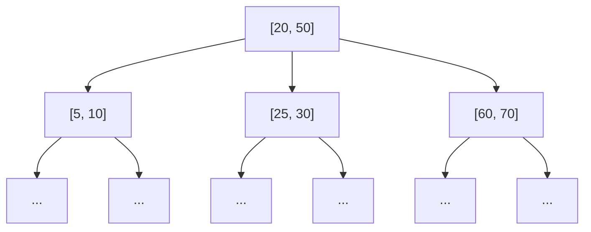

假設你要找的是數字 25：
1. 從 root 節點 \[20, 50] 開始，25 在 20 與 50 之間 → 走中間那條路。
2. 進入中間節點 \[25, 30] → 找到 25！

即使資料筆數變多，只要維持樹的平衡與分裂規則，層數也不會爆增，因此搜尋時間通常維持在 O(log N) 的效率，非常適合大量資料的快速查詢。


# B-tree 基本概念與插入示意（階數 t=2, bottom-up 分裂）

插入順序: `[10, 20, 5, 6, 12, 30, 7, 17]`

### Insert 10

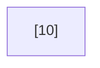

### Insert 20

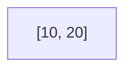

### Insert 5

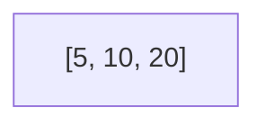

\[5, 10, 20] 滿了，分裂並將 10 上提：

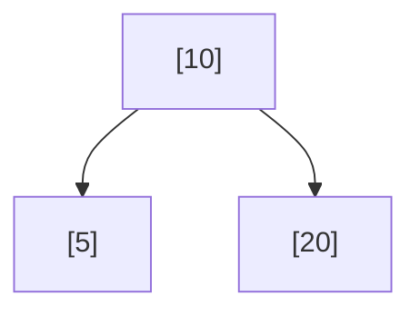

### Insert 6 → 插入左子節點

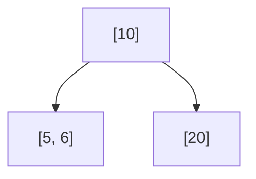

### Insert 12 → 插入右子節點

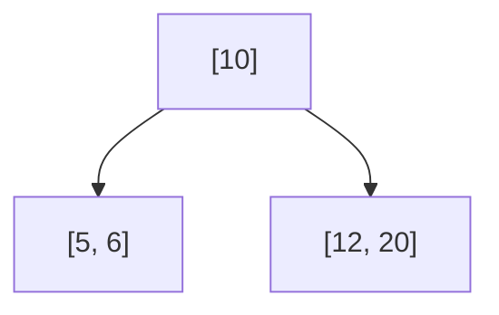

### Insert 30 → 插入右子節點，觸發分裂

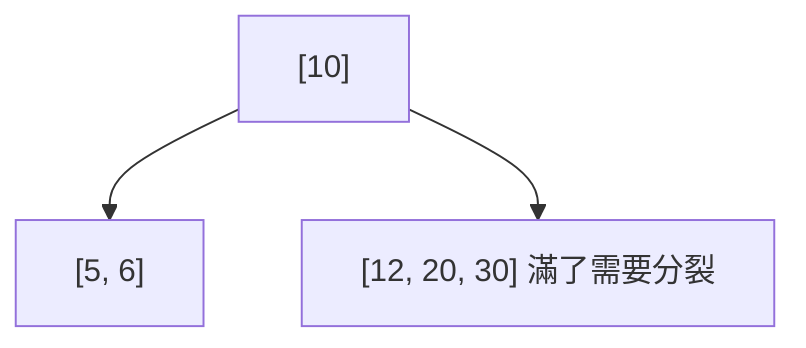

30 插入到 \[12, 20]，導致該節點滿，分裂並將 20 上提：

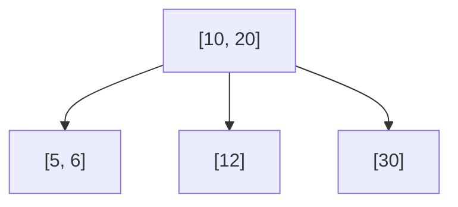

### Insert 7 → 插入左節點，觸發分裂

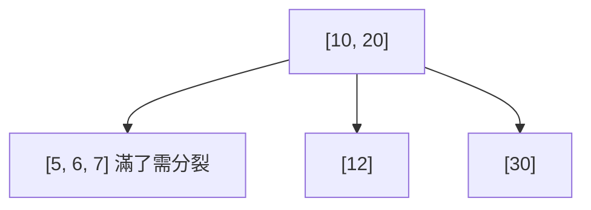

\[5, 6, 7] 滿了，因此將 6 上提，並入 \[10, 20] 內

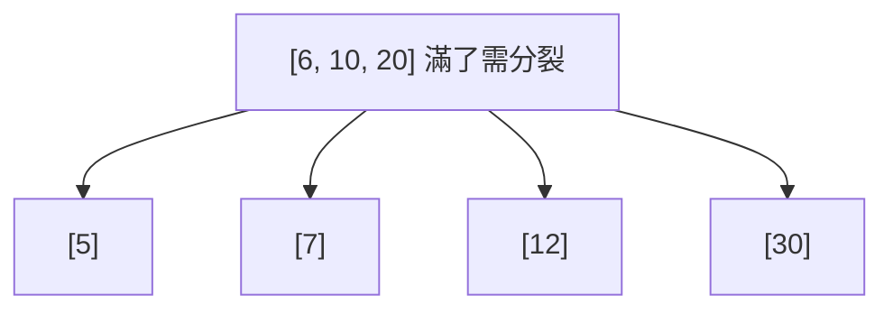

\[6, 10, 20] 滿了，因此將 10 上提

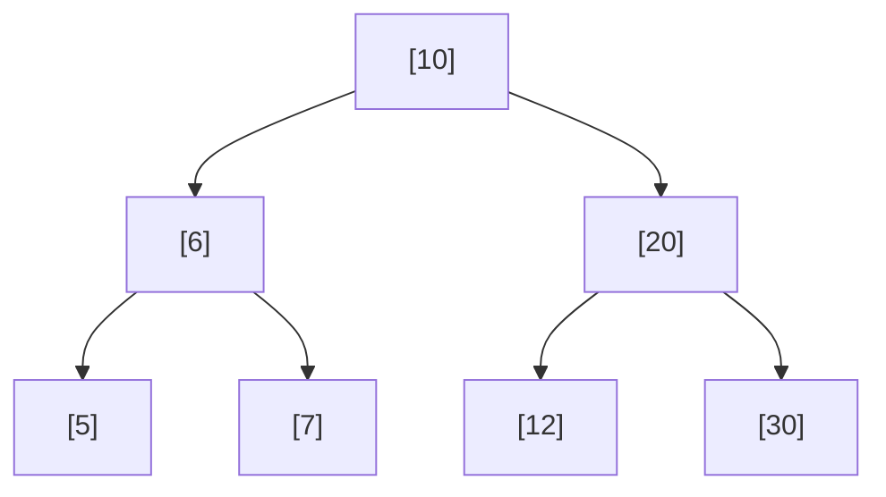

### Insert 17 → 插入 \[12] 成為 \[12, 17]

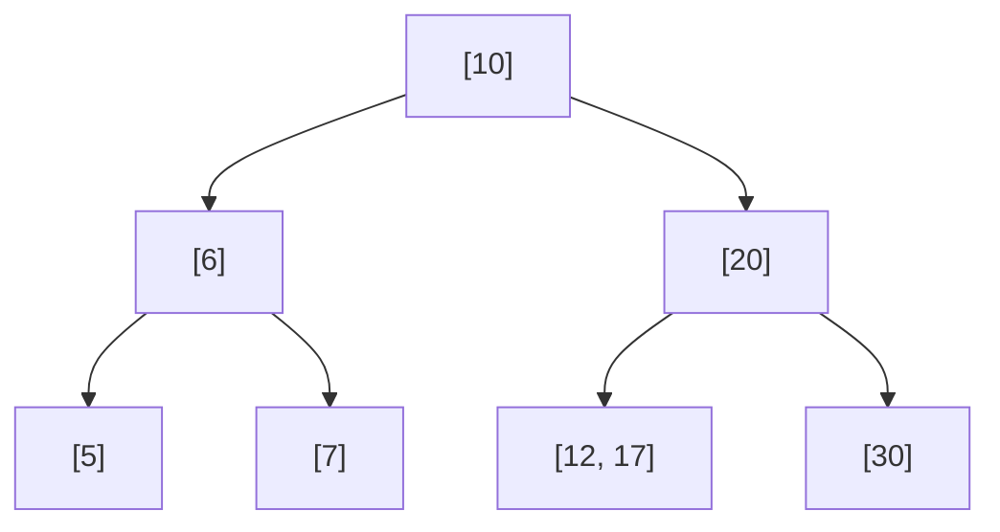

---

## 最終 B-tree 結構


這是一個以 bottom-up 分裂實現的 B-tree，插入順序 `[10, 20, 5, 6, 12, 30, 7, 17]`，結構對齊圖解預期。

# 程式碼實作（由 AI 協助撰寫與整理）

## TL;DR

```js
class BTreeNode {
  constructor(isLeaf = true) {
    this.keys = [];          // 存放鍵值（遞增）
    this.children = [];      // 子節點指標
    this.isLeaf = isLeaf;    // 是否為葉節點
  }
}

class BTree {
  constructor(order = 2) {   // order = t (最小度數)
    this.order = order;
    this.root = new BTreeNode(true);
  }

  /* ---------- INSERT（與你原本相同） ---------- */

  insert(key) {
    const res = this._insert(this.root, key);
    if (res) {                      // root overflow → split 並長高
      const newRoot = new BTreeNode(false);
      newRoot.keys = [res.promote];
      newRoot.children = [res.left, res.right];
      this.root = newRoot;
    }
  }

  _insert(node, key) {
    const t = this.order;

    if (node.isLeaf) {
      // 1) 插入到葉子
      let i = node.keys.length - 1;
      while (i >= 0 && key < node.keys[i]) i--;
      node.keys.splice(i + 1, 0, key);

      // 2) 若葉子滿 (2t-1)，回傳 split 資訊
      return node.keys.length === 2 * t - 1 ? this._split(node) : null;
    } else {
      // 找到要遞迴的 child
      let i = node.keys.length - 1;
      while (i >= 0 && key < node.keys[i]) i--;
      i++;

      const res = this._insert(node.children[i], key);

      // 若 child split，插入 promote
      if (res) {
        node.keys.splice(i, 0, res.promote);
        node.children.splice(i, 1, res.left, res.right);
        if (node.keys.length === 2 * t - 1) return this._split(node);
      }
      return null;
    }
  }

  _split(node) {
    const t = this.order;
    const mid = t - 1;                    // promote index
    const promote = node.keys[mid];

    const left = new BTreeNode(node.isLeaf);
    const right = new BTreeNode(node.isLeaf);
    left.keys = node.keys.slice(0, mid);
    right.keys = node.keys.slice(mid + 1);

    if (!node.isLeaf) {
      left.children = node.children.slice(0, t);
      right.children = node.children.slice(t);
    }
    return { promote, left, right };
  }

  /* ---------- DELETE  (完整)  ---------- */

  delete(key) {
    this._delete(this.root, key);

    // root 若被清空且非葉 → 樹高下降
    if (!this.root.isLeaf && this.root.keys.length === 0) {
      this.root = this.root.children[0];
    }
  }

  /**
   * 刪除 key，確保遞迴前 child 皆有 >= t keys
   */
  _delete(node, key) {
    const t = this.order;

    /* ---------- STEP 1：找 key 在 node 的位置 ---------- */
    let idx = 0;
    while (idx < node.keys.length && key > node.keys[idx]) idx++;

    /* ---------- 情況 A：key 在當前節點 ---------- */
    if (idx < node.keys.length && node.keys[idx] === key) {
      if (node.isLeaf) {
        /* A-1：葉節點 → 直接刪 */
        node.keys.splice(idx, 1);
      } else {
        /* A-2：內部節點 → 用 predecessor / successor 取代，再遞迴刪除 */
        const leftChild = node.children[idx];
        const rightChild = node.children[idx + 1];

        // 若左子樹有 ≥ t keys，用前驅取代
        if (leftChild.keys.length >= t) {
          const pred = this._getPredecessor(leftChild);
          node.keys[idx] = pred;
          this._delete(leftChild, pred);
        }
        // 否則若右子樹有 ≥ t keys，用後繼取代
        else if (rightChild.keys.length >= t) {
          const succ = this._getSuccessor(rightChild);
          node.keys[idx] = succ;
          this._delete(rightChild, succ);
        }
        // 兩邊都只剩 t-1 → 合併再遞迴
        else {
          this._merge(node, idx);            // 左＋key＋右 → 左
          this._delete(leftChild, key);
        }
      }
      return;                               // 刪除完成
    }

    /* ---------- 情況 B：key 不在此節點 ---------- */
    if (node.isLeaf) return;                // 到葉子仍沒找到 ⇒ 不存在

    // 確保遞迴 child 前，其 keys ≥ t
    const child = node.children[idx];

    if (child.keys.length === t - 1) this._fill(node, idx);

    // 重新定位 child（_fill 可能改變 children 結構）
    const next = node.children[
      idx >= node.keys.length + 1 ? node.keys.length : idx
    ];
    this._delete(next, key);
  }

  /* ---------- 工具函式（predecessor / successor） ---------- */
  _getPredecessor(node) {
    while (!node.isLeaf) node = node.children[node.children.length - 1];
    return node.keys[node.keys.length - 1];
  }
  _getSuccessor(node) {
    while (!node.isLeaf) node = node.children[0];
    return node.keys[0];
  }

  /* ---------- 借位（from prev / next） ---------- */
  _borrowFromPrev(parent, idx) {
    const child = parent.children[idx];
    const sibling = parent.children[idx - 1];      // 左兄弟

    // 把 parent 的分隔 key 下移到 child，兄弟最後一 key 上提
    child.keys.unshift(parent.keys[idx - 1]);
    if (!sibling.isLeaf) child.children.unshift(sibling.children.pop());
    parent.keys[idx - 1] = sibling.keys.pop();
  }
  _borrowFromNext(parent, idx) {
    const child = parent.children[idx];
    const sibling = parent.children[idx + 1];      // 右兄弟

    child.keys.push(parent.keys[idx]);
    if (!sibling.isLeaf) child.children.push(sibling.children.shift());
    parent.keys[idx] = sibling.keys.shift();
  }

  /* ---------- 合併 child[idx] 與 child[idx+1] ---------- */
  _merge(parent, idx) {
    const child = parent.children[idx];
    const sibling = parent.children[idx + 1];

    child.keys.push(parent.keys[idx], ...sibling.keys);
    if (!child.isLeaf) child.children.push(...sibling.children);

    parent.keys.splice(idx, 1);
    parent.children.splice(idx + 1, 1);           // 移掉右兄弟
  }

  /**
   * 確保 child[idx] 在遞迴前有 ≥ t keys  
   * 若不足：先嘗試向左右兄弟借位；若借不到則與兄弟合併
   */
  _fill(parent, idx) {
    const t = this.order;
    const leftOk =
      idx > 0 && parent.children[idx - 1].keys.length >= t;
    const rightOk =
      idx < parent.children.length - 1 &&
      parent.children[idx + 1].keys.length >= t;

    if (leftOk) this._borrowFromPrev(parent, idx);
    else if (rightOk) this._borrowFromNext(parent, idx);
    else {
      // 兩邊都只有 t-1 → 必須合併
      if (idx < parent.children.length - 1) {
        this._merge(parent, idx);           // 與右兄弟合併
      } else {
        this._merge(parent, idx - 1);       // 與左兄弟合併
      }
    }
  }

  /* ---------- SEARCH (保留原實作) ---------- */
  search(key) { return this._search(this.root, key); }
  _search(node, key) {
    let i = 0;
    while (i < node.keys.length && key > node.keys[i]) i++;
    if (i < node.keys.length && key === node.keys[i]) return { node, index: i };
    if (node.isLeaf) return null;
    return this._search(node.children[i], key);
  }

  /* ---------- DEBUG PRINT ---------- */
  print(node = this.root, level = 0) {
    console.log("  ".repeat(level) + `[${node.keys.join(", ")}]`);
    node.children.forEach(c => this.print(c, level + 1));
  }
}

```


## 🔗 參考資源與延伸閱讀

1. [B-trees in 10 Minutes – YouTube 教學影片](https://youtu.be/K1a2Bk8NrYQ?si=901s5UgagT-XbkY3) - 這部影片提供了清晰的視覺化流程，幫助我建立 B-tree 的基本認知與操作方式。
2. [PostgreSQL 官方文件：索引與 B-tree](https://www.postgresql.org/docs/current/indexes.html) - 深入了解 B-tree 在實際資料庫系統（如 PostgreSQL）中的應用與最佳化策略。
3. 本篇 JavaScript 實作部分，為了幫助理解整體邏輯與插入／刪除操作，我透過 AI（ChatGPT）輔助生成與優化程式碼，並根據實際學習需求進行調整。
