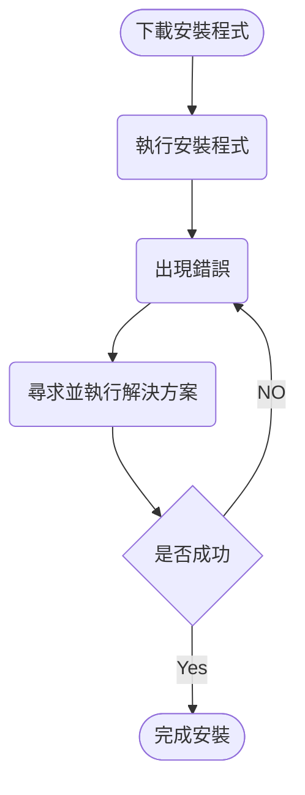
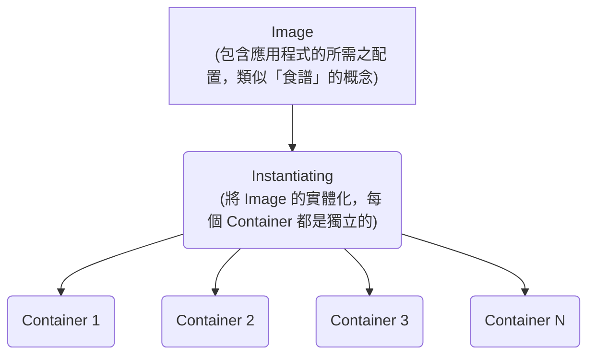
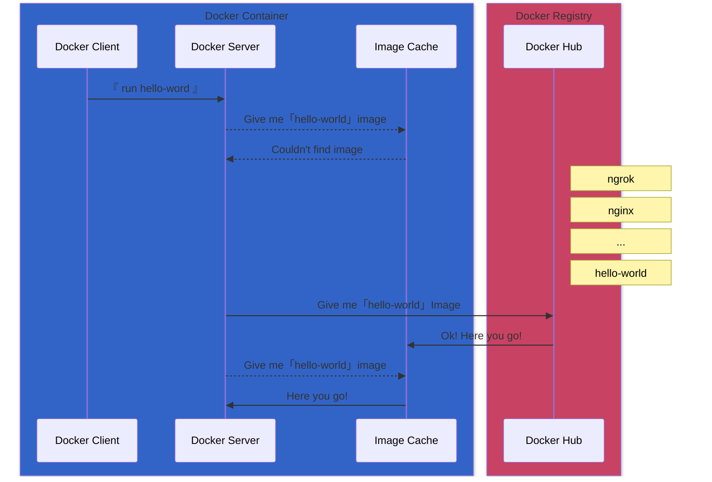
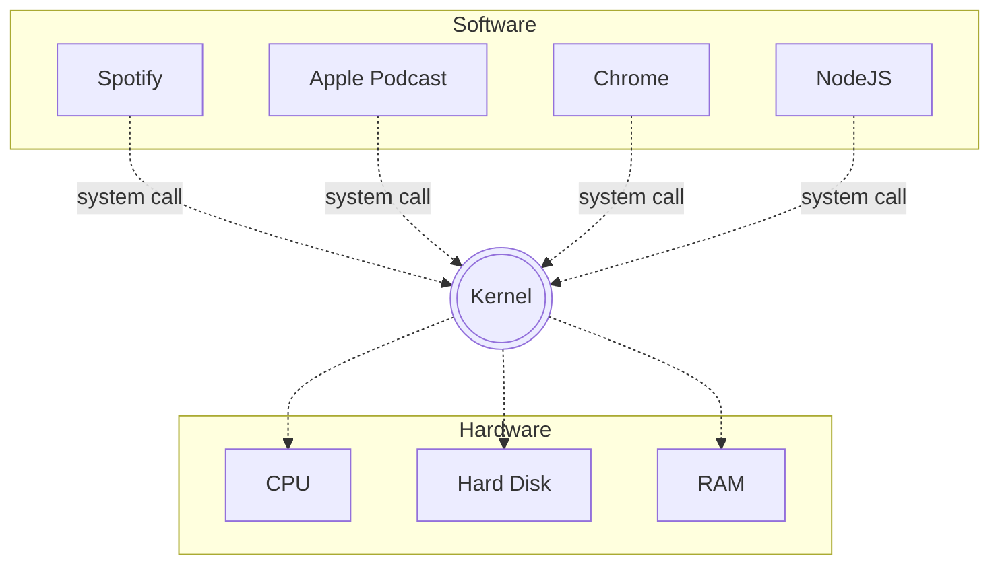
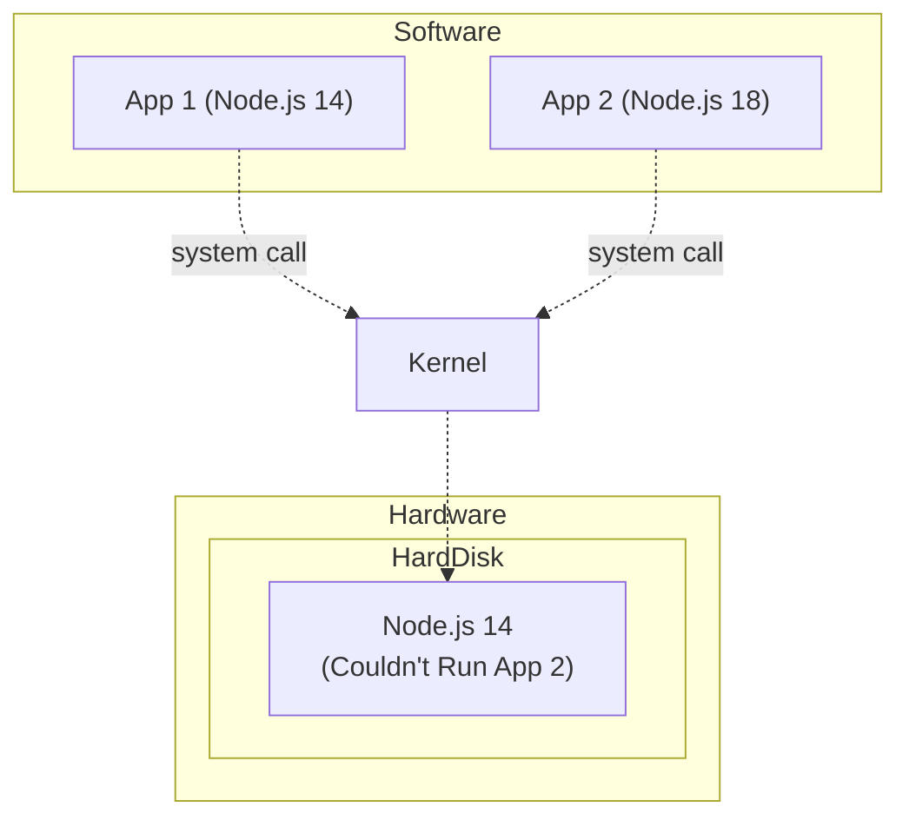
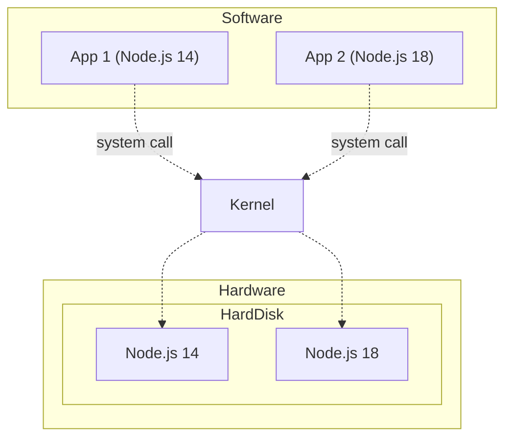

# Docker 的簡介

## **Why Docker??**
在介紹什麼是 Docker 之前呢，先講解"**為什麼使用 Docker?**"應該會比較容易理解~在過去，我們應該有過在個人電腦上安裝軟體的經驗，並且八成都會遇到一些挫折，如下圖的流程表。



在傳統的安裝過程中，可能因為作業系統或是版本相容性等問題而遇到上述麻煩，為了解決這些問題，就需要在網上尋找解決方案。然而這是一個耗時且困擾的過程，尤其是在不同的電腦上進行安裝時，每台電腦都有不同的環境設定和相依性需求。為了避免上述的無限迴圈，這就是 Docker 的核心所在，它試圖解決以上的問題。

Docker 的好處在於它使得`在不同的電腦上安裝和運行軟體變得非常簡單`。透過 Docker，我們可以將應用程式及其依賴的相關環境打包成一個稱為「Container」的獨立單元。這些 `Container 可以在不同的環境中執行，不需要擔心環境差異帶來的問題`。因此，使用 Docker 可以提高開發效率、減少部署問題，並確保應用程式在不同環境中的一致性。

Docker Container 提供了一個獨立且一致的執行環境，可以在任何支援 Docker 的電腦上運行。這意味著我們不需要擔心不同環境的差異，也不需要擔心相依性的安裝和設定。只需運行 Docker  Container ，就能確保應用程式在任何地方以相同的方式運行，從而簡化了開發、部署和維護的流程。這大大提高了效率，減少了可能出現的錯誤和疑難排解的需要。

## **範例: 啟動簡單的 Container**

為了確保電腦已正確安裝了 Docker，想快速確認 Docker 的版本號，可以使用 docker -v 或 docker --version 命令。

```console
$ docker -v
Docker version 20.10.21, build baeda1f
```

此時就可以來透過 Docker 運行簡單的 Container，如下方的指令:
```console
$ docker run hello-world
```
當執行 `docker run hello-world` 時，Docker 將根據指令以及 Image 的名稱執行一個 Container。具體一點來說，`docker run` 是一個用於創建和啟動 Container 的 Docker CLI 命令，`hello-world` 則是一個 Image 的名稱。

## **什麼是 Image?**

在上面的範例中，我們透過 Docker 將基於一個名為 `hello-world` 的 Image 啟動了 Container，但是 Image 到底是什麼東西呢?事實上，Docker Image 是`一個唯讀的模板，用於創建 Docker Container`。它包含運行應用程式所需的配置。Docker Image 可以被視為一個快照或靜態的狀態。而所謂的 Docker Container 則是 Docker Image 的實例 (Instance)。當我們運行一個 Image 時，等同於創建了一個 Container。 此外，Container 是獨立的運行單元，可以在任何支援 Docker 的環境中運行。
## **Docker Image 和 Docker Container 的關係：**

1. 先後順序：Image 是在建立 Container 之前創建的。我們可以使用 Dockerfile 來定義 Image，然後使用 `docker build` 命令來構建 Image。並且使用 Image 來創建多個Docker Containers。
2. Image 的唯讀性： Image 是唯讀的，它包含了應用程式的靜態資源和配置。我們無法直接修改 Image，但可以使用 Container 來運行並修改應用程式的狀態。
3. Container 是可寫入的： Container 是基於 Image 運行並具有可變的狀態。Container 可以在運行時修改應用程式的狀態，例如寫入文件、更新數據庫等。Container 允許我們在 Image 的基礎上進行自定義和修改。
4. 生命週期： Image 是靜態的，可以在系統中保存和共享。Container 是可執行的實例 (Instance)，有自己的生命週期。我們可以創建、啟動、停止、重新啟動和刪除 Container ，而不會影響 Image。



更白話一點，透過日常生活的例子來比喻 Image 與 Container 的關係的話，可以想像我們正在烹飪一道美食，Image 就像是一道食譜，而 Container 則是根據這個食譜烹飪出來的一道具體的菜餚。也因此我們可以創建不同的食譜 (Image)，以製作不同的菜餚， `Image 就像是定義了菜餚製作過程的食譜，它是靜態的且可以被共享`。 `Container 則是根據食譜烹飪出來的具體菜餚，它是可執行的且有自己的生命週期`。
## **構成 Docker 的基本元素**

Docker 不僅僅是一個單一的軟體工具，而是一個完整的解決方案，提供了一個綜合的平台和相關的工具，使開發、交付和運行更加簡單。除了上述介紹的 Image 以及 Container 之外，構成 Docker Ecosystem 還包括以下幾個重要元素：

```console
    ┌─────────────────────────────────────┐ 
    │ ┌─────────┐ ┌─────────┐ ┌─────────┐ │
    │ │ Docker  │ │ Docker  │ │ Docker  │ │
    │ │ Client  │ │ Server  │ │Registry │ │
    │ └─────────┘ └─────────┘ └─────────┘ │
    │ ┌─────────┐ ┌─────────┐ ┌─────────┐ │
    │ │ Docker  │ │Docker   │ │ Docker  │ │
    │ │ Images  │ │Container│ │ Compose │ │
    │ └─────────┘ └─────────┘ └─────────┘ │
    │ ...........                         │
    └─────────────────────────────────────┘
```


1. Docker Client：
  * 是與用戶進行互動的命令行界面 (CLI)，`用戶可以使用 Docker Client 發送命令和請求`，例如運行 Container 、創建 Image 等命令。
  * 可以在本地機器上運行，也可以連接到遠程的 Docker Server。
2. Docker Server：
  * 負責管理 Container 、 Image 、網絡和 Volume 等資源，以及`處理 Docker Client 發送的命令和請求`。
  * 還負責下載、創建和運行 Container 所需的 Image ，以及管理 Container 之間的通信和資源分配。
3. Docker Registry：
  * Docker Registry是用於存儲和共享Docker Image 檔的中央儲存庫。其中的 Docker Hub是官方提供的公共註冊表，用戶可以在其中找到各種官方和社區維護的 Image 檔。
  * 除了Docker Hub，還可以設置私有的Docker註冊表，用於組織內部或特定項目的 Image 檔共享
4. Docker Image:
  * 可執行的Image，它包含了執行特定應用程式所需的所有內容，如代碼、執行時所需的依賴關係和配置文件等。Docker Image 是通過 Dockerfile 文件來創建的。  
5. Docker Container:
  * 是 Docker Image 的一個運行實例 (instance)，它包含了執行應用程式所需的所有內容，包括代碼、執行時所需的依賴關係和配置文件等。
  * 可以在 Docker 環境中創建、啟動、停止、刪除。每個 Docker Container 都是獨立且可移植的，這意味著可以在任何 Docker 環境中運行，而不受任何限制。
6. Docker Compose：
  * 用於定義和運行多個 Docker  Container 的工具。
  * 使用 YAML 文件定義 Container 、網絡和 volumes 的配置，並可以通過單個命令來管理和操作這些 Container 。
  * 簡化 Multi Containers 應用的開發、部署和管理過程，使得協作和服務之間的操作更加簡單。


## **使用 Docker Client 執行指令**
在上述的**啟動簡單的 Container** 範例中，我們運行一個非常簡單的 Image，叫做 `hello-world`，它是 Docker 官方所提供，一個非常簡單的，用來 Demo 的 Image，用於檢查 Docker 安裝是否正常運作。

```console
$ docker run hello-world
Unable to find image 'hello-world:latest' locally
latest: Pulling from library/hello-world
70f5ac315c5a: Pull complete
Digest: sha256:fc6cf906cbfa013e80938cdf0bb199fbdbb86d6e3e013783e5a766f50f5dbce0
Status: Downloaded newer image for hello-world:latest

Hello from Docker!
This message shows that your installation appears to be working correctly.
```

上述的指令完整的敘述 Docker CLI 是如何將指令帶給 Docker Server 處理，我們來逐行確認輸出的每一行訊息所代表的意思: 
1. `Unable to find image 'hello-world:latest' locally`: 
  * 首先，Docker 檢查本地主機上是否已經存在名為 hello-world 的 Image。這個訊息表示在本地找不到該 Image。
2. `latest: Pulling from library/hello-world`: 
  * 由於在本地找不到 Image，Docker Server 嘗試從 Docker Hub中下載 hello-world Image。這個訊息表示 Docker 正在從 library/hello-world 庫中下載。  
3. `Digest: sha256:fc6cf906cbfa013e80938cdf0bb199fbdbb86d6e3e013783e5a766f50f5dbce0`: 
  * 這是 Image 檔的數字指紋（Digest），用於驗證 Image 檔的完整性。
4. `Status: Downloaded newer image for hello-world:latest`: 
  * 這個訊息表示 hello-world  Image 檔已經成功下載並存儲在本地主機中。

由此可知，執行 `docker run hello-world` 命令時，Docker 首先在本地尋找 hello-world  Image ，但未找到，因此從 Docker Hub 下載該 Image 檔。下載完成後，執行 Image 並輸出訊息，表示 Docker 的安裝正常運作。


在上面的流程中: 
1. Docker Client 將 run hello world 命令告知 Docker Server
2. Docker Server 首先在本地的 Image Cache 尋找 hello-world Image
3. 若未找到，Docker Server 改從 Docker Hub 尋找該 Image，並且存放在 Image Cache。
4. 在 Docker Hub 找到 hello-world，並下載至本地端的 Image Cache
## **Container 是如何啟動的?**

在介紹 Container 啟動的原理之前，先介紹一些電腦操作系統的概述。大部分操作系統 (OS) 都有一個稱為 Kernel 的部分。 Kernel 是一個正在運行的軟體程式，`負責管理所有程式與硬體之間的溝通`。如下圖表所示，在圖表的頂部，有不同程式正在運行，例如 Chrome、Apple Podcast、Spotify 以及 Node.js。如果我們透過 Node.js，將一個檔案寫入硬碟，技術上來說，`並不是 Node.js 直接與硬體設備溝通`。相反，Node.js 向 Kernel 發出指令：“嘿，我想將一個檔案寫入硬碟。”然後 Kernel 接收這個指令，最終將資訊寫入硬碟。



因此，「 Kernel 是負責管理程式和實際硬碟之間的一位仲介」。另一個重要的事情是這些運行的程式是通過稱為 `system call` 的方式與 Kernel 互動的。 `system call` 本質上就像函式呼叫一樣。 Kernel 提供了不同的 endpoint 給運行中的程式，以便說：“嘿，如果你想將一個檔案寫入硬碟，通過 system call與我溝通，利用 endpoint 提供的功能來執行特定的操作。


假設有一個的情境。有兩個 App 所需要運行的 Node.js 版本不同(App 1 需要 Node.js 14，App 2 需要 Node.js 18)，然而，困難點在於`我們的硬碟上無法同時存在 Node.js 14 以及 Node.js 18`。那麼，我們該如何解決這個問題呢？




解決方法是利用作業系統的一個特性，稱為 `Namespacing（命名空間）`。透過 NameSpacing，我們可以查看連接到電腦的各種硬體資源，並`將這些資源分割成不同的部分`。因此，我們可以創建一個專門用於存放 Node.js 14 的硬碟分割區，並創建另一個專門用於存放 Node.js 18 的分割區。然後，為了確保 App1 以及 App2 可以存取對應的分割區，每當它們中的任何一個發出 system call 來從硬碟讀取資訊時，Kernel 將檢查 system call 以確定它是來自哪個程式。透過 OS 中的 NameSpacing feature，我們可以確保 App1 和 App2 能夠在同一台電腦上運作。





## Namespacing & Contorl Groups(cgroups)

在 Docker 中，Namespacing （命名空間）和 Control Groups（控制群組）是兩個核心功能，用於提供 Container 的隔離和資源限制。雖然它們是獨立的功能，但通常一起使用以實現更強大的且多功能的環境。

```console
  Namespacing 用於隔離資源，以提供每個 process （process）獨立的環境。
  包括 process （processes）、硬碟（Hard Drive）、網路（Network）等。
  透過 Namespacing 的隔離，process 可以在自己的環境中運行。
                      ┌─────────────────────────────────────────┐
                      │ ┌──────────┐ ┌───────────┐  ┌─────────┐ │
                      │ │processes │ │Hard Drive │  │ Network │ │
   ┌──────────────┐   │ └──────────┘ └───────────┘  └─────────┘ │
   │ Namespacing  │   │                        ┌───────────────┐│
   └──────────────┘   │ ┌───────┐  ┌─────────┐ │ Inter Process ││
  Isolating resources │ │ Users │  │Hostnames│ │ Communication ││
    per process       │ └───────┘  └─────────┘ └───────────────┘│
                      └─────────────────────────────────────────┘

  Control Groups 用於限制 Container 中 process 可以使用的資源量。
  包括記憶體、CPU 使用、硬碟輸入輸出和網路頻寬。
  透過 Control Groups，系統管理者可以對 Container 中的 process 進行資源限制。                      
                      ┌─────────────────────────────────────────┐
                      │  ┌─────────┐ ┌─────────┐ ┌─────────┐    │
   ┌──────────────┐   │  │ Memory  │ │CPU Usage│ │ HD I/O  │    │
   │Control Groups│   │  └─────────┘ └─────────┘ └─────────┘    │
   └──────────────┘   │  ┌─────────┐                            │
    Limit amount of   │  │Network  │                            │
  resources used per  │  │Bandwidth│                            │
        process       │  └─────────┘                            │
                      └─────────────────────────────────────────┘
```


Namespacing 主要用於為每個 process 提供了一個獨立的環境，使每個 Container 都擁有自己獨立的 Namespacing 。這包括 Process ID（PID）、網路（network）、檔案系統（mount）、使用者 ID（UID）等。通過Namespacing 的隔離，Container 內的 process 可以感知到自己獨立運行在一個環境中，與其他 Container 和主機上的 process 相互隔離。這有助於確保 Container 的運行環境獨立且安全。

而 Control Groups 則`用於限制 Container 可以使用的資源量`。它通過將 Container 中的 process 分組並賦予這些群組特定的資源限制，如 CPU 使用、記憶體使用、網路頻寬等。這使得系統管理者可以對 Container 的資源使用進行精細調節，`防止某個 Container 佔用過多資源影響其他 Container 或主機的性能`。 Control Groups 還提供了控制和監視 Container 資源使用的工具，方便管理 Container 的運行狀態。

因此，Namespacing 和 Control Groups 是 Docker 中兩個相互補充的功能，Namespacing 提供隔離環境， Control Groups 提供資源限制和管理。它們一起確保 Container 能夠運行在一個獨立且受控的環境中，實現了高效且安全的應用程式部署和運行。

