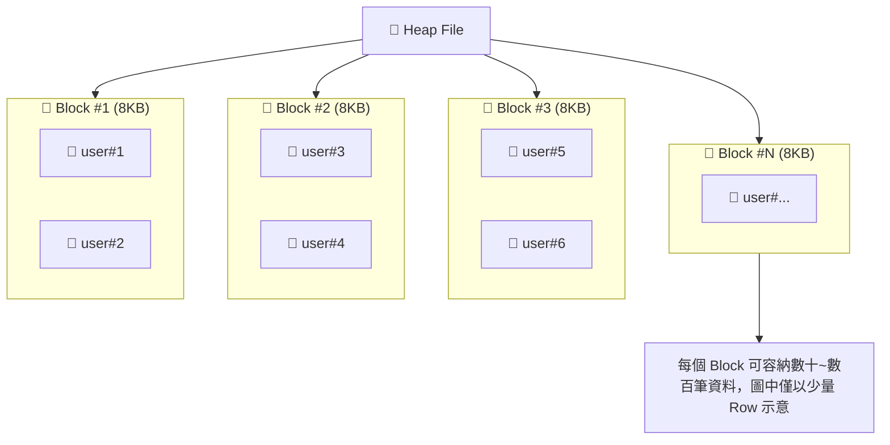
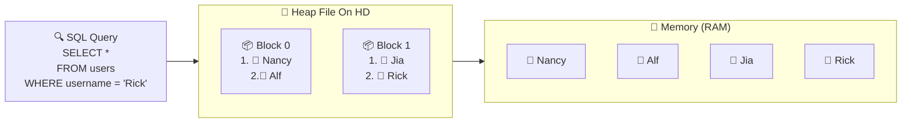
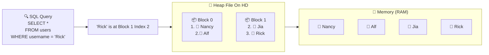

# PostgreSQL 學習筆記 - 核心概念：資料儲存與索引

1. Heap： 儲存整張 Table 所有資料列（rows）的檔案。

2. Block（或 Page）：Heap file 會被切分為多個 blocks（或 pages），每個 block 可容納若干資料列。

3. Tuple（或 Item）： Table 中的單一資料列，也就是一筆 row。

### 詳細說明



一個 heap file 用來儲存某個 Table 的所有資料，例如 users 表。整個檔案稱作 heap 或 heap file，它會被切分成許多稱為 blocks（或 pages）的小單位。

每個 block 可以存放多筆資料（也叫 tuples 或 rows），也可能是空的。無論實際存放幾筆資料，每個 block 的大小固定為 8KB。
也就是說，就算某個 block 裡只有一筆資料、甚至完全沒有資料，它仍然佔用 8KB 空間。

* Heap file 負責儲存 Table 的內容
* 它會被分割成許多 8KB 的 blocks
* 每個 block 可存放任意數量的資料列，甚至為空


### Block 資料配置


所謂的 block 指的就是實際存放在電腦硬碟裡的一塊資料。我們的硬碟只認得 0 和 1（二進位），所以這個 block 結構圖其實是在告訴我們：這一長串的 0 和 1 被分成好幾個區域，每個區域有不同的用途。

```console
+-------------------------------------------------------------+
|                        BLOCK / PAGE                         |
+---------------------------+---------------------------------+
| HEADER (固定 24 bytes)     | ITEM POINTER ARRAY (向下增長)    |
| ├─ LSN / Checksum / Flags | Offset 1 → Tuple 1              |
| └─ Free-space Pointer     | Offset 2 → Tuple 2              |
|                           | Offset 3 → Tuple 3              |
+---------------------------+---------------------------------+
|                                                             |
|                                                             |
|                  Free Space (隨著資料插入而縮小)               |
|                                                             |
|                                                             |
+-------------------------------------------------------------+
|                       TUPLE DATA AREA （向上增長）            |
|  ┌───────────────────────────────────────────────────────┐  |
|  │ Tuple 3 (Row 3)                                       │  |
|  ├───────────────────────────────────────────────────────┤  |
|  │ Tuple 2 (Row 2)                                       │  |
|  ├───────────────────────────────────────────────────────┤  |
|  │ Tuple 1 (Row 1)                                       │  |
|  └───────────────────────────────────────────────────────┘  |
+-------------------------------------------------------------+
```


**最上面是「管理區」（HEADER）**
- 存放這個 block 的基本資訊，比如編號、檢查碼等等
- 就像倉庫入口的告示牌，告訴你這個倉庫的基本資料

**接下來是「索引區」（ITEM POINTER ARRAY）**
- 這裡不存實際的資料，而是存「地址」
- 告訴你「第1筆資料放在倉庫的哪個角落」、「第2筆資料在哪裡」
- 就像倉庫的貨物清單，記錄每樣東西的位置

**中間是「預留空間」（FREE SPACE）**
- 目前還沒用到的空間，留給未來新增的資料
- 就像倉庫裡還沒放東西的空地

**最下面是「實際資料區」（TUPLE DATA AREA）**
- 真正的資料就放在這裡
- 像是倉庫裡實際堆放的貨物

所以當我們看這個結構圖時，其實就是在了解 PostgreSQL 如何有條理地管理硬碟空間，確保資料不會亂放，而且能快速找到需要的資料。


### Full Table Scans


假設我們想從 users Table 中找出所有 username 為 "Rick" 的使用者。

> **重要觀念**  
> 當資料儲存在硬碟上的 heap file 中時，PostgreSQL 無法直接在磁碟上檢查內容。  
> 它必須先把相關資料載入到記憶體中，才能開始處理。

執行這個查詢的過程如下：



**步驟一：載入資料**  
掃描 heap file 裡的所有 blocks，然後將它們（以及裡頭的資料列）載入記憶體。

**步驟二：逐筆檢查**  
資料一旦進入記憶體，PostgreSQL 才會進一步過濾出 username 為 "Rick" 的使用者。這通常需要逐筆檢查每一筆資料列。

但這裡有個關鍵問題需要注意：
* 磁碟讀取成本高：從磁碟將資料載入記憶體，是一種相對昂貴的操作。
* 逐筆比較耗時：即使成功載入，PostgreSQL 仍需逐列比對資料是否符合條件。

當系統必須從磁碟讀入幾乎整張Table ，並逐筆檢查每一列時，就會觸發我們所說的：Full Table Scan（全表掃描）這種查詢方式通常值得我們多加關注，因為它往往代表：也許有更有效率的解法。

在這個例子中，這段查詢確實會導致一次 full table scan。但有沒有更有效率的方式，來執行這個查詢？ 答案是 `索引（Index）`。


### 什麼是 索引（Index）？

如果我們有一個**外部工具**，它不屬於 Table 本身，但能告訴我們某筆資料在 heap file 裡的確切位置，例如想要查詢 username 為 "Rick" 的資料，把這個條件交給那個工具，它就能回應你：

> **工具回應：**  
> 「喔，Rick 的資料在 block 1、index 2。」

有了這個資訊，PostgreSQL 就能：
- 直接跳到 block 1
- 只載入那一個 block
- 取出 Rick 的資料
- 完全不需要讀取其他像 block 0 的無關內容




這樣的工具在 PostgreSQL 中就是所謂的 **Index（索引）**，**索引是一種資料結構**，它能告訴 PostgreSQL：
- 哪一個 block 裡有你要的資料
- 那筆資料在 block 裡的哪個位置（offset 或 index）

所以如果你查詢 user "Rick"，索引就像一本精準的查詢手冊，馬上告訴你：

> **索引回應：**  
> 「Rick 在 block 1, index 2。」

因此，我們可以把 索引（Index） 想成是一份位於Table 之外的 目錄，用來將查詢條件（例如 username）對應到 heap file 中資料的實際位置。