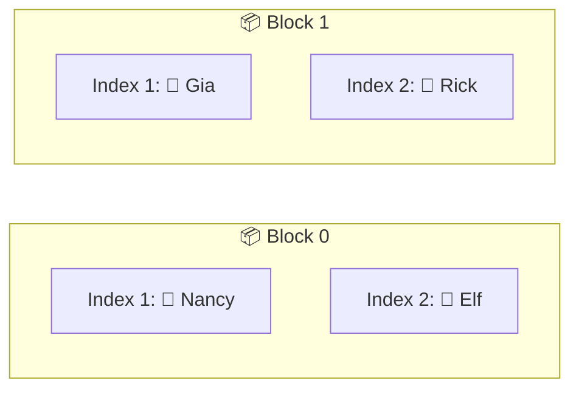
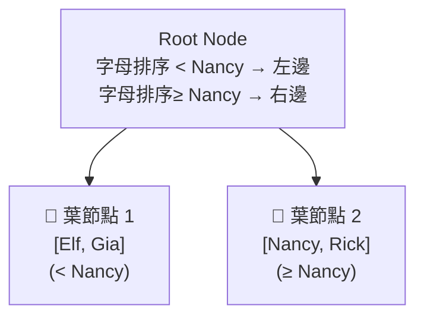

# PostgreSQL 學習筆記 - 索引（Index）

## 索引（Index）的工作原理

索引是一種資料結構，能夠大幅提升資料庫查詢的效能。下方透過一個具體例子來了解索引是如何運作的。

### 步驟一：選擇要建立索引的欄位

建立索引的第一步是決定要在哪個欄位上進行快速查找。假設我們經常需要根據使用者名稱（username）來查找特定使用者：

在這種情況下，可以會在 **username** 欄位上建立索引，因為這能讓快速根據使用者名稱找到對應的使用者。
```sql
CREATE INDEX ON users (username);
```
> ✅ 建立索引是為了加速 **`username` 欄位** 的查找操作


### 步驟二：從 Heap File 中提取數值

接下來，透過遍歷整個堆積檔案（users 資料表），對每一列資料提取目標欄位的值——在這個例子中就是 username。除了 username 之外，還會記錄這個值來自**哪裡**（具體來說就是 Block 編號和 Block 內的 index）。



索引只包含：
- 使用者名稱（username）
- 對應的區塊和索引位置

### 步驟三：對提取的數值進行排序

取得數值後，對它們進行**排序**：

- 字串：按字母順序排序（A → Z）
- 數字：可能按升序或降序排序
- 日期：可能從最早到最晚排序

在我們的例子中，我們按字母順序排序使用者名稱：
- Elf
- Gia
- Nancy
- Rick

### 步驟四：建立完整的樹狀結構（B-tree）

將排序後的記錄組織成一個完整的**樹狀結構**。

一開始，我們把所有排序好的資料放入一個**葉節點（Leaf Node）**：


當資料量增加時，我們需要制定**分割規則**來管理資料。我們選擇 "Nancy" 作為分割點，建立以下規則：
- 小於 Nancy 的資料 → 放在左邊
- 大於等於 Nancy 的資料 → 放在右邊

並根據這個分割規則，建立 **根節點（Root Node）**，將資料分割到對應的**葉節點**：



這樣就形成了一個完整的樹狀結構(B-Tree)：
- **根節點**：定義分割規則，決定資料應該放在哪個葉節點
- **葉節點**：根據規則存放對應的資料和位置資訊

### 使用建立的索引來查找資料吧!

假設我們要查找使用者 "Rick"，查詢的流程大致如下：
1.	從索引的根節點開始比對，並根據條件判斷範圍
3.	因為 "Rick" 大於等於 "Nancy"，所以往右邊的葉節點走
4.	在那裡找到了 "Rick"，對應的位置是 Block 1, Index 2

有了這個位置信息，PostgreSQL 就能直接跳到 Block 1 的 Index 2，只讀取那一筆資料，而不必掃過整張表。

---


## 某些情況下，PostgreSQL 會自動產生的索引


### Primary Key 索引
PostgreSQL 會自動為每個資料表的 **primary key** 欄位建立索引。

### Unique Constraint 索引
同樣地，只要在欄位上加了 **UNIQUE** 約束，PostgreSQL 也會自動建立對應的索引。

```sql
CREATE TABLE phones (
    id SERIAL PRIMARY KEY,
    name VARCHAR(20) UNIQUE
);
```

如果我們發現自己經常需要根據手機的名稱來查找資料，並希望與名稱相關的查詢能夠儘可能快，其實我們不需要另外建立索引，因為該欄位本身就有設定唯一性（uniqueness）限制。PostgreSQL 會自動幫我們在這個欄位上建立索引！


## 相關語法

### 建立索引

```sql
-- 在 users 資料表的 username 欄位上建立索引
CREATE INDEX ON users (username);
```

### 刪除索引

```sql
-- 刪除索引
DROP INDEX users_username_idx;
```

### 工具分析

- `EXPLAIN`：讓資料庫告訴你「我打算怎麼執行這個查詢」
- `EXPLAIN ANALYZE`：讓資料庫「實際執行查詢」，然後告訴你「我花了多少時間，走了什麼路線」
我路況如何」

---


## 索引的缺點

索引雖然能大幅提升效能，但並非沒有代價。在真實的資料庫環境中，我們不會在每個欄位上都建立索引，原因如下：

### 1. 儲存空間成本

當我們建立索引時，其實就是在背後建立一棵樹狀結構（B-Tree），幫助資料更快被找到。過程中會從每一列資料中抓出指定的欄位值，然後記下它在資料檔案裡的位置（像是哪一個區塊、哪個位置）。這些資訊會存成一份檔案，實際寫到硬碟上，不只是放在記憶體裡，所以會多佔一些空間，而且裡面也包含部分原始資料的複本。

下方透過 pgAdmin 可以檢查資料表和索引的大小：
```sql
SELECT pg_size_pretty(pg_relation_size('users'));            -- 例如：880 kB
SELECT pg_size_pretty(pg_relation_size('users_username_idx')); -- 例如：184 kB
```

在這個小規模的例子中，184kB 的索引大小可以忽略不計。但在真實應用中，如果 users 資料表有 80 GB，那麼索引可能就會佔用 18 GB！

### 2. 寫入效能成本（INSERT / UPDATE / DELETE）

每次我們在資料表中插入、更新或刪除資料時，PostgreSQL 不只要處理資料本身，還得一併更新相關的索引。
換句話說，如果插入 20 列資料，PostgreSQL 除了要寫入 20 筆資料，也會對每一個索引執行 20 次更新。

這表示：索引越多，寫入越慢，在寫入量大的應用中，太多索引會讓效能大幅下降。同樣地，若進行大量更新或刪除操作，也會因為每次都要同步修改索引而造成效能瓶頸。

### 3. 即使我們建立了索引，PostgreSQL 也不一定會使用它。

PostgreSQL 是否使用索引，還是要取決於查詢的內容、資料的分佈情況，以及查詢規劃器 （Planner）對執行成本的估算。如果 PostgreSQL 判斷進行循序掃描（Sequential Scan）會比走索引更有效率，它就會選擇不用索引。

>這個判斷邏輯，我在後面的內容中進一步說明。

---

## PostgreSQL 如何決定要不要使用索引？

### 使用索引 vs 全表掃描

下方例子來了解 PostgreSQL 如何決定是否使用索引：

```sql
SELECT *
FROM users
WHERE username = 'Rick';
```

---

### 使用索引的流程

使用 `users_username_idx` 查找特定使用者（例如 username 為 'Rick'）：

1. **找出 username 是 'Rick' 的使用者**：
   - 讀取索引的根節點
   - 跳到某個子節點（page），這是隨機存取
   - 處理該節點中的值，找出對應的使用者位置

2. **開啟 users 的堆積檔案**

3. **跳到包含該使用者的區塊**（也是隨機存取）

4. **從這些區塊中讀出對應的使用者資料**

> 💡 **重點**：整個過程等於是在硬碟上隨機存取兩個頁面（步驟 1 與 3）。

---

### 不使用索引的流程

直接掃描整個 users 資料表：

1. **開啟 users 的堆積檔案**
2. **從第一個區塊開始載入所有使用者資料**
3. **逐一檢查每位使用者，看 username 是否符合條件**
4. **重複此流程，直到掃完所有區塊**

> 💡 **重點**：這個方法就是依序載入整個堆積檔案的所有頁面。

---

### 效能考量

從硬碟中「隨機位置載入資料」（使用索引的方式），通常會比「順序載入資料」（一個區塊接著一個區塊）花更多時間。

---

## 實際範例

### 範例 1：少量資料查詢（會使用索引）

首先，檢查符合條件的資料量：

```sql
SELECT COUNT(*) 
FROM likes
WHERE created_at < '2013-01-01';
```

**結果**：63,000 筆資料

查看執行計劃：

```sql
EXPLAIN SELECT *
FROM likes
WHERE created_at < '2013-01-01';
```

**執行結果**：
```
Seq Scan on likes (cost=0.00..14248.11 rows=751934 width=24)
  Filter: (created_at < '2013-01-01 00:00:00+08'::timestamp with time zone)
```

針對 `likes` 的 `created_at` 欄位新增索引：

```sql
CREATE INDEX ON likes (created_at);
```

再次使用 EXPLAIN 檢視，會發現使用了索引進行搜尋：

```sql
EXPLAIN SELECT *
FROM likes
WHERE created_at < '2013-01-01';
```

**執行結果**：
```
Bitmap Heap Scan on likes (cost=1160.07..6781.70 rows=61890 width=24)
  Recheck Cond: (created_at < '2013-01-01 00:00:00+08'::timestamp with time zone)
  -> Bitmap Index Scan on likes_created_at_idx (cost=0.00..1144.60 rows=61890 width=0)
      Index Cond: (created_at < '2013-01-01 00:00:00+08'::timestamp with time zone)
```

---

### 範例 2：大量資料查詢（不會使用索引）

檢查符合條件的資料量：

```sql
SELECT COUNT(*) 
FROM likes
WHERE created_at > '2013-01-01';
```

**結果**：689,009 筆資料

此時使用 EXPLAIN 檢視，會發現該查詢並**不會**使用索引：

```sql
EXPLAIN SELECT COUNT(*) 
FROM likes
WHERE created_at > '2013-01-01';
```

**執行結果**：
```
Seq Scan on likes (cost=0.00..14248.11 rows=690118 width=24)
  Filter: (created_at > '2013-01-01 00:00:00+08'::timestamp with time zone)
```

---

## 為什麼 PostgreSQL 選擇不使用索引？

我們在 `created_at` 欄位上建立了索引，但 PostgreSQL 最終仍選擇執行循序掃描（sequential scan）。為什麼會這樣？

**主要原因**：查詢從 `likes` 資料表中抓取了大量資料。

### 索引的設計初衷

索引擅長幫我們快速找到「少量且特定」的資料筆數。但在這個案例中，查詢一次要抓出大約 70% 的 likes 資料，佔比非常高。

### 使用索引的成本分析

如果 PostgreSQL 使用索引的話，它會需要：

- 掃過大約 70% 的索引葉節點
- 跟著這些指標去存取大量堆積檔案中的資料區塊
- 在磁碟上進行大量隨機讀取（random access）

### 循序掃描的優勢

這樣的存取方式反而效率更差，所以 PostgreSQL 判斷不如直接做循序掃描，依序讀取磁碟上的：

```
block 0 → block 1 → block 2 → ...
```

這樣可以避免磁碟跳來跳去帶來的額外負擔。

> ⚠️ **關鍵提醒**：即使建立了索引，PostgreSQL 也會根據查詢的具體情況決定是否使用，而不是盲目地使用所有可用的索引。