# Terminology

## Heap (or Heap File)

File that contains all the data(rows) of our table

## Tuple (or Item)

Individual row from the table

## Block (or Page)

The heap file is divided into many different 'blocks' or 'pages'. Each page/block stores some number of rows.


### Detail

```mermaid
flowchart TD
    direction TB

    HeapFile["📂 Heap File"]
    
    subgraph Block4["🧱 Block #N (8KB)"]
        user7["👤 user#..."]
    end

    subgraph Block1["🧱 Block #1 (8KB)"]
        user1["👤 user#1"]
        user2["👤 user#2"]
    end

    subgraph Block2["🧱 Block #2 (8KB)"]
        user3["👤 user#3"]
        user4["👤 user#4"]
    end

    subgraph Block3["🧱 Block #3 (8KB)"]
        user5["👤 user#5"]
        user6["👤 user#6"]
    end


    HeapFile --> Block1
    HeapFile --> Block2
    HeapFile --> Block3
    HeapFile --> Block4

    Comment["📌 注意：每個 Block 可容納數十~數百筆資料，圖中僅以少量 Row 示意"]
    Block4 --> Comment
```



Think of it as: 16429 — just a simple way to remember the concept. (#16429 ->儲存 users 的 Table 資料)

A heap file hold all the data for a single table (ex: users table)

The entire file is referred to as a heap or heap file.  
This file is subdivided into many blocks (also known as pages), and each block stores a number of tuples, items, or rows.
Each block can contain zero items — meaning no users at all — or it can contain many items, or anything in between.
By default, each block or page is 8 kilobytes in size.  
So even if a block contains only one item, or none at all, its size will still be 8KB.  
The next block, no matter how many items it contains, will also be 8KB in size.
So at this point, we understand that:
  - A heap file stores data
  - It is divided into blocks (or pages)
  - Each block is always 8KB in size

### Block Data Layout

```console
+----------------------------------------------------------------------------+
|                                BLOCK / PAGE                                |
+---------------------------+------------------------------------------------+
| HEADER (Fixed 24 bytes)   | ITEM POINTER ARRAY (Grows downward)            |
| ├─ LSN / Checksum / Flags | Offset 1 → Tuple 1                             |
| └─ Free-space Pointer     | Offset 2 → Tuple 2                             |
|                           | Offset 3 → Tuple 3                             |
+---------------------------+------------------------------------------------+
|                                                                            |
|                                                                            |
|                  Free Space (Shrinks as data is inserted)                  |
|                                                                            |
|                                                                            |
+----------------------------------------------------------------------------+
|                       TUPLE DATA AREA (Grows upward)                       |
|  ┌────────────────────────────────────────────────────────────────────┐    |
|  │ Tuple 3 (Row 3)                                                    │    |
|  ├────────────────────────────────────────────────────────────────────┤    |
|  │ Tuple 2 (Row 2)                                                    │    |
|  ├────────────────────────────────────────────────────────────────────┤    |
|  │ Tuple 1 (Row 1)                                                    │    |
|  └────────────────────────────────────────────────────────────────────┘    |
+----------------------------------------------------------------------------+
```

Now, when I show you this kind of structure — these boxes on the screen — you might be wondering:
*What do these boxes actually represent?*

Well, when we talk about block number one, we're referring to a specific chunk of data that is physically stored on your computer's hard disk.

Your hard disk stores all information in binary — zeros and ones.  
So when we look at this block structure, we're essentially talking about how different sequences of zeros and ones inside the block are used to store various pieces of information.

You can imagine that behind the scenes, what we’re really seeing is just a long sequence of binary data.

- Maybe the very first set of bits at the top of the block is dedicated to storing metadata about the block itself.
- The next portion might be used to store metadata about the data rows stored in the block — but not the rows themselves.
- These bits don’t contain the actual data like user IDs or names. Instead, they tell us *where* to find each row within the block.

Then there’s a section — usually a large gray area in diagrams — that represents **free space**.

By "free space," we mean a region of binary data that is currently unused.  
This area is reserved for future data that might be inserted into the table.

Finally, at the bottom of the block, we get to the actual data — the real tuples.  
So this might include the binary representation of *tuple 2*, followed by *tuple 1*, for example.

Once again, when we look at the diagram, we’re essentially analyzing the raw layout of binary data and understanding the purpose of each segment.

So this is a **very low-level** discussion.  
But it’s essential for understanding how PostgreSQL manages data on disk.

In the next video, we’ll examine a real block — one that’s stored on *my* hard drive — though everything we cover will apply just as well to blocks on *your* system.

We’ll take a look at the actual zeros and ones and explain the role of each section within the block in more detail.


### Full Table Scans

```mermaid
flowchart LR
    direction LR

    %% 查詢區塊
    Query["🔍 SQL Query 
    SELECT * 
    FROM users
    WHERE username = 'Rick'"]
    %% Heap file 結構
    subgraph Disk["💾 Heap File On HD"]
        Block0["
        📦 Block 0 
        1. 👤 Nancy 
        2.👤 Alf"]
        
        Block1["
        📦 Block 1
        1. 👤 Jia 
        2. 👤 Rick"]
    end

    %% Memory 載入區塊
    subgraph RAM["🧠 Memory (RAM)"]
        Row1["👤 Nancy"]
        Row2["👤 Alf"]
        Row3["👤 Jia"]
        Row4["👤 Rick"]
    end

    %% 資料流程
    Query --> Disk
    Disk --> RAM
```



Let’s imagine what happens when we run a query like the one shown here.

Suppose we want to retrieve all users, but only keep those with a username of "Rick".

One important thing to keep in mind is that when data is stored in a heap file on your hard drive,
Postgres cannot simply scan the file directly on disk.

In other words, to examine the user data, Postgres must **first load the relevant data into memory**.

So, step one for this query would be:
  - Look at all the blocks inside the heap file.
  - Load the blocks — and the user records inside them — into memory.

Once the data is in memory, Postgres can then apply further filtering — in this case, to find only users whose username is "Rick".

This typically involves scanning through each user record one by one until matching records are found.

Now, **loading data from disk into memory is relatively expensive in terms of performance**.

As database engineers, we try to minimize how much data gets read from disk and moved into memory.

This is one of the **key principles in optimizing database performance**, and something we’ll spend a lot of time studying.

Even once the data is in memory, Postgres still needs to search **record by record**, comparing each one against the filtering condition.

When the database loads a large portion — or even all — of a table from disk and iterates over each row individually, this is called a **full table scan**.

A full table scan occurs when Postgres must:
  - Load many or all rows from a heap file into memory,
  - Then iterate over each of them to find matches.

You’ll see the term “full table scan” mentioned frequently in PostgreSQL performance articles and blog posts.

Many of these will claim that full table scans are **always** a performance problem.

But in reality, that’s not always the case.

There are **some scenarios** where a full table scan is actually **preferable** to the alternatives.

We’ll explore those cases later.

That said, full table scans are often a sign that performance **might** be suboptimal, so they typically **warrant investigation**.

In this specific example, our query would result in a full table scan.

Therefore, we should ask:  
*Is there a more efficient way to execute this query?*


### What is Index?

```mermaid
flowchart LR
    direction LR

    %% 查詢區塊
    Query["🔍 SQL Query 
    SELECT * 
    FROM users
    WHERE username = 'Rick'"]
    Index[" 'Rick' is at Block 1 Index 2"]
    %% Heap file 結構
    subgraph Disk["💾 Heap File On HD"]
        Block0["
        📦 Block 0 
        1. 👤 Nancy 
        2.👤 Alf"]
        
        Block1["
        📦 Block 1
        1. 👤 Jia 
        2. 👤 Rick"]
    end

    %% Memory 載入區塊
    subgraph RAM["🧠 Memory (RAM)"]
        Row1["👤 Nancy"]
        Row2["👤 Alf"]
        Row3["👤 Jia"]
        Row4["👤 Rick"]
    end

    %% 資料流程
    Query --> Index
    Index --> Disk
    Disk --> RAM
```



What if we could retrieve specific records from a heap file **without** having to load the entire file into memory first?

How would that work?

For example, how could we find just the user named *Rick* without loading all user records?

Well, imagine if we had some kind of **external tool** — something that existed outside of the heap file or table —  
that could tell us exactly **where** each user is located within the heap file.

So if we ran a query asking for "user Rick" and fed it into this tool, it could respond with:
  > "Oh, user Rick? I know where that record is. It's in **block 1, at index 2**."

With that information, Postgres could then go directly to block 1, load just **that** block into memory, and retrieve the data for user Rick —  
all **without** touching other blocks like block 0 or any unrelated data.

That would be pretty useful, right?

And in fact, Postgres **does** provide such a tool — it's called an **index**.

An **index** is a data structure that tells Postgres:
  - *Exactly* which block contains the desired record
  - *Exactly* where in that block the record is located (the offset or index)

So if we pass a query into an index — for example, asking for user "Rick" —  
the index might respond:  
  > "Rick is at block 1, index 2"

Then Postgres can go straight to that block, load it, and extract only what we need.

This is the core idea behind what an index does.

You can think of an index as an **external record book** that maps specific query conditions (like a username) to precise locations inside the heap file.

Now, to really understand **how an index works internally**, it helps to start by looking at **how an index is created**.

Once you see how an index is built behind the scenes, you’ll have a clearer understanding of:
  - How it functions during a query
  - Why it’s fast
  - And what its trade-offs are (e.g., storage, update overhead)
