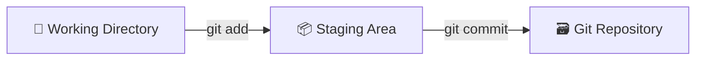

# Git 簡介

> 本文為 [The Git & Github Bootcamp
](https://www.udemy.com/course/git-and-github-bootcamp/
) 之學習筆記，內容經消化吸收後以筆記方式歸納記錄下來。

 Git 是一種版本控制系統，目前世上有許多版本控制系統，但 Git 是世上最有名 (最多人使用)的那一個，而所謂的版本控制系統，是指程式在開發過程中其內容會有所改變，因此我們可以透過版控系統來追蹤以及管理程式碼隨著時間推移而變化的內容。 該軟體可以讓使用著回顧程式碼早期版本的樣貌或是比較不同版本的內容差異等等...

##  Git 可以達到

* 追蹤文件在不同時期的內容差異
* 追蹤專案在不同版本的差異
* 將程式碼回溯到較早期的版本
* 與他人共同開發程式碼

##  Git ≠ GitHub

Git 是在自身電腦運行的版本控制系統，而GitHub是在網路上託管Git儲存庫 (Git Repository)的服務，Git 使用者可以將他們的 Repository 上傳至 GitHub ，藉由 GitHub 與其他人共同開發、維護、分享程式碼。

> 與 GitHub 有著相同功能的服務有許多，如 Gitlab 、 Bitbucket ，但 GitHub 的使用者較多 


### **GitHub**
 GitHub 是一個基於Git的 repository 託管平台，可以用來存放 repository ，藉此我們可以隨時隨地存取或分享我們的 repo ，但它最大的賣點在於"與他人合作進行專案開發"。

1. **合作**  
透過 GitHub 平台，我們可以自己開啟一項專案，並邀請志同道合的朋友一起進行開發。

2. **開源專案**  
許多著名的開源專案都將repo部署在 GitHub 上，如[React](https://GitHub.com/facebook/react)也將 GitHub 作為他們的家，在上面有許多來自世界各地的人都一起對這個專案進行開發。也可

3. **曝光**  
我們可以將作品部署在 GitHub 上，藉此作為作品展示的平台


## 儲存庫 (Repository)

又可以稱為 "Repo" ，是指在一個資料夾內，可以透過 Git 進行程式碼追蹤、維護的工作區域 (Workspace)，每當進行一個專案的開發時，會創立一個該專案的資料夾，並在該資料夾內建立新的 Repo 。每個專案應擁有自己專屬的 Repo，Repo 與 Repo 之間是獨立的，不會互相干涉其內容。

## Git Bash

Bash 是一種命令列介面 (Command Line Interface, CLI) ，能執行使用者在窗口輸入的命令，由於Git最初是用於Linux核心開發的版本控制工具，因此被設計成能在 Unix-based interface (如Bash) 執行的軟體，然而 Windows 使用的是非 Unix-base 的 CLI (叫做 Command Prompt , 命令提示字元)，因此無法直接在 Windows 系統中進行 Git 的操作，幸虧 Git Bash 的出現，讓 Windows 使用者可以在一個類 Bash 的環境下執行 Git 的命令操作。

# Git 工作流程 (Git WorkFlow)

Git Workflow 可以想像成單機遊戲的存檔流程，謹慎的玩家會在關卡的初期、中期、後期進行存檔的動作，過程中死亡時還可以讀檔避免之前的努力都白費了，而要讓 Git 追蹤文件在不同時期的變化，也必須在不同時期進行"存檔"的作業，也就是暫存 (Stage) 以及提交 (Commit) 的動作。其流程如下:

1. `工作目錄 (Working Directory)` :  
在工作目錄下我進行資料的建立、修改、刪除的作業

2. `暫存區域 (Staging Area)` :  
將工作目錄下更動的所有 (或是部分) 內容加入暫存區域

3. `提交 (Commit)` :  
將暫存區域的內容提交給 Repo，如此一來就完成存檔的作業



> 只要在 Repo 底下，內部的文件、資料夾 (包括資料夾中的資料夾及文件) 都會被 Git 追蹤

# Git 基礎指令

## 設定Git Name & Email

```console
~$ git config --global user.name "Rick Chiu"

~$ git config --global user.email <email-name>@gmail.com
```

> `--global` 為全域選項，使用該指令後，只要在該電腦內，即使不同Repo都會套用 `user name="Rick"` 以及 `user email=< email-name >@gmail.com` 。

## 建立 Git Repo

```console
~$ git init
```

在進行 Git 操作之前，需透過 `git init` 建立一個新的 Repo ，後續才可以進行 Git 操作

## 確認狀態

```console
~$ git status
```

`git status` 指令可以提供在工作區域 (Working Directory) 內的狀態，下方為輸入該指令後出現的資訊:

* Changes to be committed:  
存放的是 **已更動 (新增、刪除、修改) 的內容，但尚未被放置暫存區 (Staging Area)**

* Changes not staged for commit:
存放的是 **已更動 (新增、刪除、修改) 的內容，且已存放在暫存區，但尚未被提交 (Commit)**

```console
On branch master
Your branch is up to date with 'origin/master'.

Changes to be committed:
  (use "git restore --staged <file>..." to unstage) 
        modified:   apple.txt

Changes not staged for commit:
  (use "git add <file>..." to update what will be committed)
  (use "git restore <file>..." to discard changes in working directory)
        modified:   banana.txt
```

## 加入暫存區 (Staging)

```console
~$ git add 文件名稱
```

透過 `git add 文件名稱` 將特定的文件加入暫存區，也可以透過 `git add .` 將所有更動的內容一次全部加入暫存區。

> 加入暫存區 (Staging) 這個動作可以想像成提交 (commit) 的必要前置作業

## 提交 (Commit)

```console
~$ git commit -m 'message'
```

透過 `git commit -m message` 指令可以將暫存區內的內容提交給 Repo ，也就完成了"存檔"的動作，在 `-m` 後可以加入此次更動的訊息內容，如 `fix bugs` 、 `add xxx function` ...

## 修正上次的提交訊息

若在 commit 之後才發現 Commit Message 有錯字，或是忘記將另一個文件加入暫存區時，但又不想要而外加入新 commit ，可以透過 `git commit --amend` 來進行修正，指令輸入後會跳出一個文件視窗，讓你修正上一次的 Commit Message 。

```console
~$ git commit -m "some commit"
~$ git add forgotten_file
~$ git commit --amend
```

> 該方法僅能修正最近一次的 commit

## 檢視提交的歷史紀錄

```console
~$ git log
```

`git log` 指令可以檢視過去所提交的 commit 資訊，其中 `git log --oneline` 則是將每則 commit 資訊簡化，方便閱讀:

```console
54948ab (HEAD -> master) add grape in fruit.txt
1a37821 add banana in fruit.txt
8542b04 add apple in fruit.txt
22a645a create fruit.txt
```

---

## 提交的一些細節

### 原子提交 (Atomic Commits)

盡可能地在程式碼經歷獨立事件 (功能) 的更動後即進行 commit 的動作，如此一來，當我們檢視每個 commit ( `git log` ) 時，每個 commit 都代表著單一獨立的更動事件，在進行該 commit 的撤銷或是回溯時不會出現混淆的情況，也可以方便檢視。

**盡量避免下方的 commit 出現** (下方三個 commit 都與 Toggle Function 有關)

```console
f715058 Finish Toggle Function Finally Finished
5aa0893 Toggle Function almost finished
5b4006f add Toggle Function but not finished yet
```

### 以現在式敘述

在[ Git 官方文件](https://git-scm.com/book/en/v2/Distributed-Git-Contributing-to-a-Project)中有提到:  
 Write your commit message in the imperative: "Fix bug" and not "Fixed bug"
or "Fixes bug." 也就是盡量以現在式的動詞來撰寫 Commit Message 。

---

## 忽略文件

我們可以告訴 Git 在我們的 Repo 內，有哪些文件或資料夾不要進行追蹤，這些文件大多是包含重要的機密資訊 (如 API keys ) ，只要在 Repo 的根目錄位置建立 .gitignore 文件，並把不想被追蹤加入 .gitignore 內，如此一來，這些機密文件就不會被提交。如下方範例:

```console

apple.txt
忽略名稱為apple.txt的文件

*.txt
忽略所有附檔名是.txt的文件

fruit/
忽略名稱為fruit的資料夾以及在其內部的文件

fruit/banana.txt
# 忽略 fruit目錄下的banana.txt文件

/fruit/*.txt
忽略fruit目錄下附檔名是.txt的文件
```
