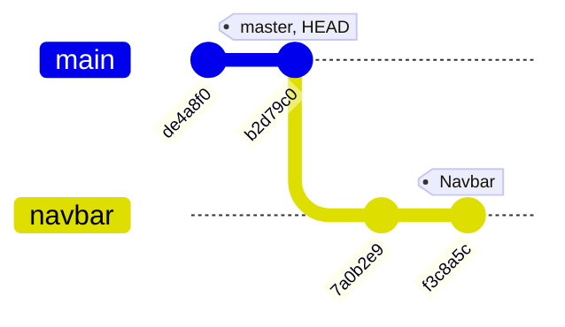
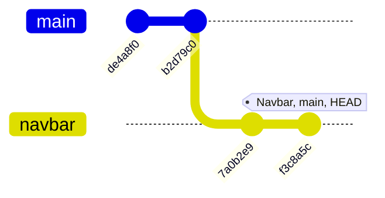
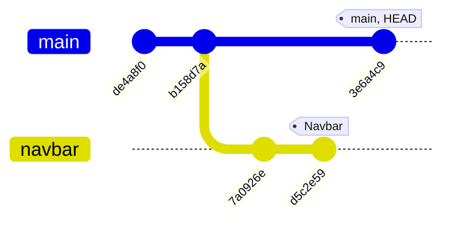
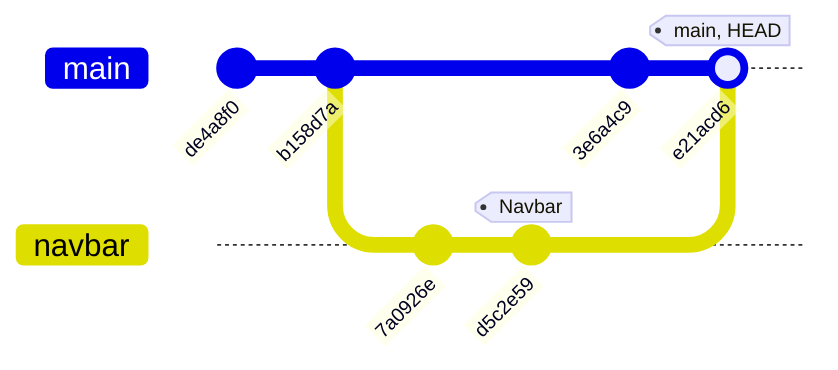

# 分支 (Branch) & 合併 (Merge)

> 本文為 [The Git & Github Bootcamp
](https://www.udemy.com/course/git-and-github-bootcamp/
) 之學習筆記，內容經消化吸收後以筆記方式歸納記錄下來。

## 分支 (Branch)

當進行一個網站的開發時，可能會面臨到下面幾種情況

1. 負責的某個表單 Component 有 2 種不同的版面設計，但不確定哪一個較適合。
2. 負責的另一個 Navbar Component 遇到了 Bug ，需要一些時間修復。
3. 開發同仁剛完成了 SearchBar Component 的開發。
4. 另一位開發同仁正在開發所負責的 Landing Page 。


上述情境下，由於多人針對同一個專案進行不同功能的開發以及修復，因此存在著多種版本，為了讓專案在多版本情況下同時進行開發與 Bug 修復，就必須使用到 Git 分支 (Git Branch)。


分支是 Git 中重要的一環，所謂的分支可以想像成一個專案在多個不同時間線上的發展，時間線上所發生的事並不會互相干涉，也就是在自己所處的分支上進行新功能的開發僅會改變自己分支的內容，並不會影響其他人所在分支 (除非進行合併操作)。

### **什麼是 Master** ?

所謂的 Master，就是眾多分支中的主幹，大部分的專案在進行開發時，都會以 Master Branch 作為開發的基礎，並從其中延伸出許多分支進行不同功能的開發。

> 2020年時，為了提倡種族平權的相關議題， GitHub 將 Repository 內的 master branch 改名成 main branch 。

### **什麼是 HEAD** ?

在開發過程中，可能需要在不同的分支進行切換，而 HEAD 會指出我們目前所在的位置，如下方輸入 `git log --oneline` 時，顯示我正位於 Master 分支內的 16e01e4 commit 。

```console
~$ git log --oneline

16e01e4 (HEAD -> master) add grape 
09b69b4 add orange 
905e592 add fruit.txt
```

### **檢視分支**

```console
~$ git branch
```

使用 `git branch` 會列出該 Repo 內有那些分支，並指出目前目前所處的位置 (星號標記)，而 Git 所預設的分支就是 Master 。而 `git branch -v` 則會顯示各分支最後的 commit 以及 commit message 。

```console
~$ git branch -v

  master        637517f fix bug
* navbar        9b86012 add toggle function
  landing-page  3764650 finish landing page
```

### **建立分支**

```console
~$ git branch <branch-name>
```

使用 `git branch < branch-name >` 可以從當前位置 (HEAD) 建立一條分支，該指令僅有建立分支的功能，不會將目前位置移到該分支上 (也就是 HEAD 位置仍不變)

### **切換分支**

```console
~$ git switch <branch-name>
```

在進行分支建立後，可以輸入 `git switch < branch-name >` 切換到該分支。

### **建立分支並移動**

```console
~$ git switch -c <branch-name>
```

相對 `git branch -c < branch-name >` 而言， `git switch < branch-name >` 除了會建立一個分支外，還會將自身位置移動到該分支上。

### **其他切換分支的方法**

```console
~$ git checkout -b <branch-name>
```

> 在過去的 Git 本版中，會使用 `git checkout -b < branch-name >` 來進行分支的切換，但因為 `checkout` 這個指令有太多額外的功能，為了不讓人混淆，才開發出 `switch` 這個較具有特定功能的指令。

### **刪除分支**

```console
~$ git branch -d <branch-name>
~$ git branch -D <branch-name>
```

假如分支已經順利合併到 Master 時，可以透過 `git branch -d < branch-name >` 將該分支刪除，若要強制刪除未順利合併的分支，可以使用 `git branch -D < branch-name >` 。

### **將分支重新命名**

```console
~$ git branch -m <changed-branch-name>
```

---

## 合併 (Merge)

在開發專案時，我們可以透過分支來同步進行不同功能的開發，但最終這些功能都需要被整合在一起，而 Git 就是透過 Merge 將這些分支進行合併的動作。
* 合併的單位是分支，而非 commit
* 若要將 B 分支合併至 A 分支，位置需處於 A 分支

### **流程** 

1. 若要將  B  分支合併至  A  分支，需將目前位置  (HEAD)  移動到  A  分支。
2. 使用  git merge  指令將  B  分支的內容合併到  A  分支。

### **Fast Forward Merge**

當目前位置 (HEAD) 是該分支上的 root commit ，此時進行的合併就是 Fast Forward Merge ，也就是 HEAD 會直接移動到被合併的 commit 位置，且不會額外增加新的 commit 。 如下方範例:

假設我想將 Navbar 分支合併到 Master 分支上，必須先移動到 Master ，此時的示意圖如下:

```console
~$ git switch master
```



透過 `git merge navbar` 進行合併後，目前位置 (HEAD) 會移動到被合併的 commit 位置。

```console
~$ git merge navbar
```



### **非 Fast Forward Merge**

假如開發同仁在 main 分支上添增新的功能或是搶先一步將其他分支合併到 main 上，進而出現新的 commit ，此時我們再去進行合併，就不會是 Fast Forward Merge ，而且 Git 會要求我們額外新增一個新的 commit (merge commit) 。 如下方範例: 

將 Navbar 分支合併到 main 分支上，必須先移動到 main 的 root commit (3e6a4c) 上。

```console
~$ git switch main
```



進行合併時，由於 Navbar 分支是從 master 上的舊 commit (b158d7a) 延伸出去，而目前所處位置為新 commit (3e6a4c9)，此時的合併就不是 Fast Forward Merge 。 Git 會跳出 Merge Message 視窗要你為這次的合併做一個 commit 。

```console
~$ git merge navbar
```



### 合併衝突 (Merge Conflict)

合併有時會伴隨著衝突的發生，假設在兩條分支都在針對同一個文件內容進行修改，並且都想合併進 master 分支時，衝突就容易發生，在這個情況下 Git 並不會幫我們處理衝突，而是跳出訊息告知有衝突發生了，請你手動解決衝突，並且下一個 commit 。

### 解決衝突的流程

1.  若發生合併衝突， Git 會跳出衝突的文件，請我們手動解決
2. 修改文件，決定哪些內容該留下或是刪除
3. 將文件內的標記衝突區域的符號移除 (如>>>>>、 <<<<<<、========)
4. 儲存檔案並為這次的改動下一個 commit 

當合併時會跳出下方的訊息，告知某文件在過程中出現衝突，此時會跳出衝突文件要我們手動去解決

```console
CONFLICT (content): Merge conflict in songs.txt
Automatic merge failed; fix conflicts and then commit the result.
```

下方顯示跳出的文件內容多了一些標記符號 (<<<<< HEAD、=====、>>>>> Navbar ) ，主要用來標示衝突的區域，此時就可以在該區域決定內容的去留，修改完畢記得將標記符號刪除並存檔，最後一個步驟就是為這次的更動下一個commit就完成並解決這次的合併衝突。

```console
<<<<< HEAD 
<div>
    Conflict content 1
</div>
========================
<div>
    Conflict content 2
</div>
>>>>>> Navbar
```
