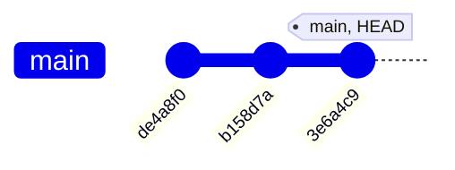
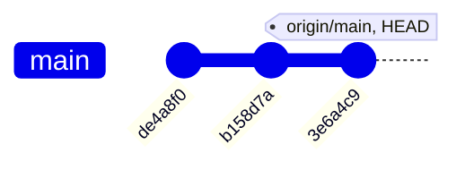
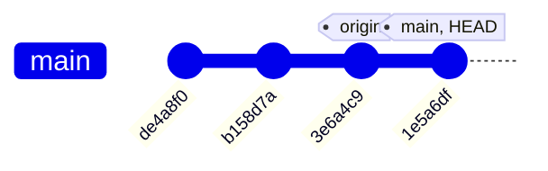

# 遠端 (Remote) 

> 本文為 [The Git & Github Bootcamp
](https://www.udemy.com/course/git-and-github-bootcamp/
) 之學習筆記，內容經消化吸收後以筆記方式歸納記錄下來。

若我們想將 repo 從本地端 (local) 推送到 GitHub ，需先告知 Git 推送的"**目的地**"，目的地又被稱為遠端 (remote) ，"目的地"需包含兩個資訊，分別為 1. 名稱 (remote name) 以及 2. 地址 (remote URL) 。

### **檢視遠端**

當我們已經從 GitHub 上複製一份 repo 到電腦中，此時就可以透過 `git remote` 或 `git remote -v` 來檢視該 remote 名稱以及 URL 。

```bash
~$ git remote -v
origin  https://GitHub.com/Chiuweichung/xxx (fetch)
origin  https://GitHub.com/Chiuweichung/xxx (push)
```

### **新增遠端**

若要將電腦中的 repo 推送到 GitHub 平台上，需先告知 Git 推送的目的地，就像是寄送貨物時告知貨運司機送貨地址一樣，透過 `git remote add < remote-name > < URL >` 指令，其中的 origin 是 remote 的名稱，< URL >則是 remote 的位置。

```bash
~$ git remote add <remote-name> <URL>
```

```bash
~$ git remote add origin https://GitHub.com/ChiuWeiChung/xxx.git
```

### **什麼是 Origin** ?

origin 並非那麼特別，當我們從 GitHub 複製一項 repo 時，它的"**預設 remote 名稱就是origin**"， origin 僅僅是 remote 名稱，用來代表該 URL ，事實上我們可以將 origin 改成任何名子。

---

## 遠端分支 (Remote Branch) & 本地分支 (Local Branch)

### **什麼是遠端追蹤分支 (Remote Tracking Branches)**?

遠端追蹤分支是作為遠端分支 (remote branch) 與本地方之 (local branch) 的橋樑，標記如 `< remote >/< branch > `，稱為 remote reference 。例如 `origin/main` 表示 remote repo 的 main branch 。如下方示意:

在 GitHub 上的 remote repo (又稱 origin ):



從 GitHub Clone 下來的 local repo ，起初 head 與 remote reference (origin/main) 都指向同一個 commit (3e6a4c9)。



若我們在 local repo 下了一個 commits ，此時 local repo 內的 HEAD 移至新commit(1e5a6df) ，但 remote reference 仍不變。



輸入 git status 可以看到下方資訊，其中的 "Your branch is ahead of 'origin/main' by 1 commits." ，這是因為 remote reference 起到了"書籤"的作用， Git 此時知道 local repo 相較 remote repo 多出了 1 個 commit 。

```bash
~$ git status
On branch current
Your branch is ahead of 'origin/main' by 1 commit.
  (use "git push" to publish your local commits)

nothing to commit, working tree clean
```

> Remote Tracking Branch 可以想像成"書籤"的概念，作為本地與遠端之間的標記

### **檢視 Remote Checking Branch 內容**

```bash
~$ git checkout origin/main
```

透過 `git checkout origin/main` 可以達到 Detached HEAD 的效果，用來檢視當初從 remote repo 複製下來時的模樣。

### **檢視 remote repo 有多少 Branches**

當我們從 GitHub 複製 repo 時，僅會出現存在這 main branch ，其他 branch 並不會馬上出現在 local repo 內，若輸入 `git branch` 也只會出現 main branch 存在。但若輸入 `git branch -r` 則可檢視remote repo 有多少 branches 。

```bash
~$ git branch 
main

~$ git branch -r
origin/HEAD -> origin/main
origin/ main
origin/ food 
origin/ music
```

### **連結 remote 與 local 的 Branch**

若僅僅要檢視 remote repo 內的 food branch 內容，可以只輸入 `git chekcout origin/food` 來做到 detached HEAD ，但若要在 local repo 內建立一個如 remote repo 的 food branch ，可以輸入 `git switch food` 指令。

```bash
~$ git switch <remote branch name>
```
